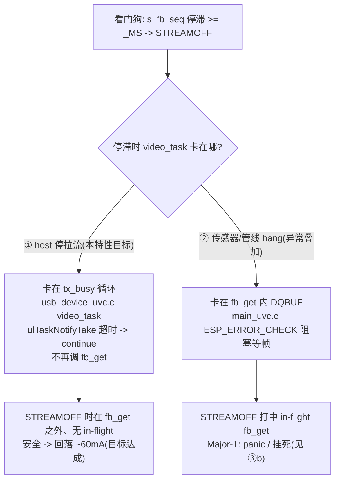
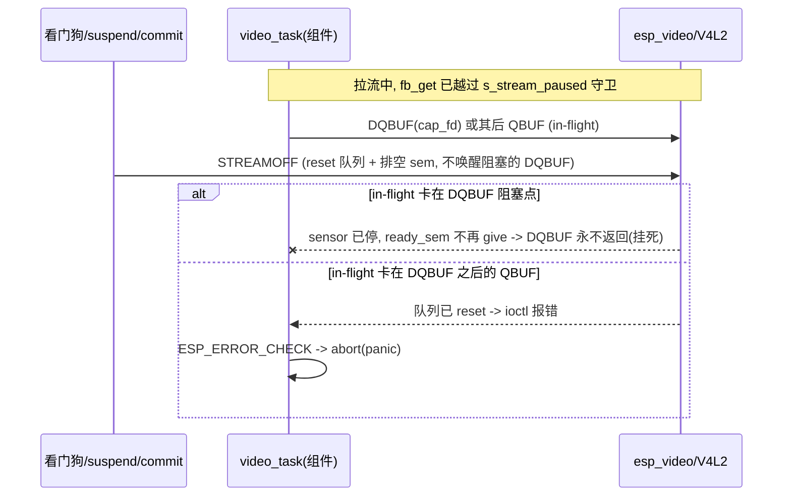

# WT9932P4-TINY 新增摄像头 USB UVC 例程 设计文档（Spec）

- **状态**：主体已实现并完成 OV5647 真机点亮、UVC 出图与 bulk/monitor 调优；Task 13 可选停流功耗看门狗（`EXAMPLE_UVC_IDLE_STREAMOFF`：Kconfig 选项 default n、本项目 `sdkconfig.defaults` 覆盖为默认开）已实施（Cloud 双态构建通过、真机实测停流回落 ~60mA、host 重开 PROBE→COMMIT 恢复出图正常）。默认 1920×1080@30 真机 device 侧实测约 15–16fps（bulk 串行流水线瓶颈，见 Q41）。分支 `cursor/uvc-camera-example-03dd`，PR #4（draft）。
- **关联 Plan**：已创建（`docs/superpowers/plans/2026-07-17-uvc-camera.md`）。
- **参考实现**：
  - 乐鑫 [`esp_video/examples/uvc`](https://github.com/espressif/esp-video-components/tree/master/esp_video/examples/uvc)（USB **Device** UVC，本例程主蓝本）。
  - 上游 [`wireless-tag-com/WT9932P4-TINY` 的 `video_lcd_display`](https://github.com/wireless-tag-com/WT9932P4-TINY/tree/main/video_lcd_display)（**本板厂商官方例程 / 板级权威蓝本**：板级配置以它为准）。
  - 社区 [`r4d10n/esp32p4-uvc-video`](https://github.com/r4d10n/esp32p4-uvc-video)（**社区/个人项目**：P4 + OV5647 + 2-lane MIPI + 1920×1080 RAW10 30fps + UVC MJPEG/H.264 over **USB HS bulk**）。**仅供软件参考**（证明 1080p@30 MJPEG over bulk 可行、ISP/编码/UVC 代码可借鉴）；其平台是 Olimex DevKit、且 **XCLK 由 MCU(GPIO40) 生成**（与本板依赖模块自带晶振不同），**硬件接线不照搬**。

**双蓝本定位**：本例程采用**双蓝本 + 传感器自配**三层分工——**板级层**（SCCB 引脚 8/7、reset/pwdn=-1、2.5V CSI PHY LDO、SPIRAM 200M、`ISP_PIPELINE_CONTROLLER`、`FREERTOS_HZ` 等）以**同板 `video_lcd_display` 为权威**（`XCLK_PIN=-1`/无 MCU XCLK 的依据是 D12 对本板 J2 树莓派 15-pin 线序 + OV5647 模块自带晶振的分析，非 `video_lcd_display`——后者用 SC2336、时钟路径不同、未证一致）；**UVC 应用层**（USB Device UVC 框架、`usb_device_uvc`、MJPEG 编码链、相关 Kconfig）参考乐鑫 `esp_video/examples/uvc`；**传感器层**（OV5647 RAW10 1080p、25MHz 晶振、IPA JSON）自配（两蓝本均用 SC2336、不覆盖 OV5647）。

---

## 1. 概述

给 WT9932P4-TINY 新增一个摄像头 demo：用 **OV5647** 经 MIPI-CSI 采集，走 P4 **ISP**（RAW10→RGB/YUV）与**硬件 JPEG 编码器**压成 **MJPEG**，通过 **USB UVC（Device）** 把开发板变成一个标准 USB 摄像头，电脑端（macOS）用 QuickTime / Photo Booth / OBS 直接打开——**无需显示屏、无需 WiFi/蓝牙、无需自研上位机**。目标 **1920×1080@30fps**（含 fallback，见 D4）。例程融入 dev 既有的「单 app + `main/CMakeLists.txt` 的 `SRCS` 注释切换 demo」脚手架（方案 A），入口文件 `main/main_uvc.c`，并设为**默认激活**的 demo；板级初始化复用官方 `example_video_common`（**复制到本地 `components/`**）。

## 2. 背景与动机

- WT9932P4-TINY 板载 MIPI-CSI（树莓派 15-pin 线序）与 MIPI-DSI 接口，但用户手上**无显示屏**；ESP32-P4 本身**无 WiFi/蓝牙**（本 TINY 板也无 C6 协处理器），故常见的「CSI→LCD 显示」或「网络推流」方案都不适用。
- ESP32-P4 的差异化能力在于 **USB 2.0 高速（HUSB，480Mbps）+ 硬件 JPEG/H.264 编码 + ISP**，天然适合做「USB 摄像头（UVC Device）」。乐鑫官方 `esp_video/examples/uvc` 正是此场景的现成蓝本，仅支持 ESP32-P4。
- 用户最初设想「串口传 JPEG + 自研上位机」，经 grilling 对比后改用 UVC——带宽高、且免上位机开发（系统原生把板子当摄像头）。

## 3. 需求

功能性：

- R1：`main/` 下新增 `main_uvc.c`，实现「OV5647 采集 → ISP → 硬件 JPEG(MJPEG) → USB UVC 输出」，参照官方 `esp_video/examples/uvc`（复用 `example_video_common` 板级初始化 + `usb_device_uvc`）。
- R2：`main_uvc.c` 融入 `SRCS` 切换模式，并作为**默认激活**的 demo（其余 demo 退回注释备选）。
- R3：依赖引入（见 D9）——`main/idf_component.yml` 追加 **`esp_video ^2.3.0`**、**`usb_device_uvc ^1.3.1`**、**`esp_cam_sensor ^2.3.0`**（Registry，不锁精确、不提交 `dependencies.lock`）；**`example_video_common` 复制到本地 `components/example_video_common/`**（它非 Registry 组件，不能声明依赖）。
- R4：传感器配置为 **OV5647 @ RAW10 1920×1080 30fps**；UVC 输出 **MJPEG @ 1920×1080 30fps**（见 D4/D13 的 fallback 与配置项）。
- R5：板级用 `example_video_common` 的 **"Customized Development Board"**，MIPI-CSI SCCB I2C 引脚 **SCL=IO8 / SDA=IO7**；`XCLK_PIN=-1`（依赖模块自带晶振，见 D12）。
- R6：相关配置追加到根 `sdkconfig.defaults`（**按功能分段注释**）与 `sdkconfig.defaults.esp32p4`（追加 flash size + SPIRAM，见 D14；P4 rev<3.0 两项不动）；在**现有** `main/Kconfig.projbuild`（blink 的 Example Configuration）中**追加** JPEG 质量项、H.264 参数项（`I_PERIOD`/`BITRATE`/`MIN_QP`/`MAX_QP`）与停流看门狗选项、**保留 blink 菜单**（见 D13）。
- R7：更新 `AGENTS.md` 的「选择运行哪个 demo」章节，纳入 uvc 例程说明。
- R8：提交本次 superpowers 流程新增的文档（本 spec 与配套 plan）入库。

非功能性：

- N1（不破坏现有）：其余 demo 源文件与顶层工程结构不变；沿用 `CONFIG_IDF_TARGET="esp32p4"` 与 P4 revision 配置。
- N2（开箱即用）：默认 `SRCS` = `main_uvc.c`，新环境 / CI 执行 `idf.py build` 直接构建并覆盖本例程。
- N3（与 CI 一致）：CI 只构建激活的 demo，默认激活本例程即让 CI 编译验证它，无需改 CI；产物仍为 `build/WT9932P4-TINY.bin`。
- N4（跨平台查看）：MJPEG 为 macOS/Linux/Windows 三端通用，选它保证换机/演示不改固件。

## 4. 设计决策（D1–D14，均经 grilling 与用户确认）

- **D1（传感器 = OV5647）**：三块候选（IMX219、Luckfox SC3336、另购 SC2336/OV5647）中选 OV5647。`esp_cam_sensor` **支持 OV5647、不支持 IMX219 与 SC3336**（有同系列 SC2336）；IMX219 需自写 Sony 驱动+软件 demosaic；SC3336 硬件排线为 Luckfox 专用线序、用户无转接线；SC2336 货源少且贵。OV5647 = 树莓派原生线序（与本板 J2 完美匹配、同向 FPC 直插；⚠️实测反向接会电源反接、有烧毁风险（短时实测未损坏，见 §7/Q54/§11 真机记录））、货源多且便宜、驱动现成。型号选「65度500万」（带 IR 滤光片、白天色准、标准视角、最薄最便宜）。
- **D2（输出 = USB UVC Device）**：把板子做成标准 USB 摄像头，走 HUSB 高速口。免上位机、带宽高。区分 UVC **Device**（板子当摄像头，本例程）与 UVC **Host**（板子读外接摄像头）。
- **D3（编码 = MJPEG）**：macOS 对 H.264 over UVC 兼容差；MJPEG 被 QuickTime/OBS 稳定支持、且三端通用；带宽约占 USB HS 理论 480Mbps 的 6%–13%（MJPEG ~30–60Mbps，见 Q4），绰绰有余。
- **D4（分辨率/帧率 = 1920×1080@30fps + 默认 bulk）**：OV5647 唯一 16:9 高清档（RAW10）；显式设置 UVC 1920×1080@30。实现初期采用 isoc，真机 1280×960@45 时因本库每微帧仅 1 包（1023B，约 65Mbps）使实际帧率约 23fps，故最终默认切为 **bulk**（`CONFIG_UVC_MODE_BULK_CAM1=y`）以提高总线利用率（演进与证据见 Q28/Q34/§11）。bulk 解除 USB 带宽瓶颈后，设备端串行取帧/编码成为主要瓶颈；isoc 保留为低延迟、固定带宽但无重传的备选。若仍需提帧率，可降 JPEG 质量或切 1280×960@45 / 800×* 档，并同步修改 `UVC_CAM1_FRAMESIZE_WIDTH/HEIGT`（上游 `HEIGT` 拼写漏一个 H、勿改）。
- **D5（组织 = 方案 A 单 app）**：融入 dev 单项目 `SRCS` 切换，不建独立子项目。已知代价（见 §7）：依赖被所有 demo 共享编译（双向）、sdkconfig 全局化——用户已接受。
- **D6（默认激活本 demo）**：`SRCS` 设 `main_uvc.c` 激活、其余注释，让 `idf.py build`/CI 直接编译验证、烧录开箱即用。
- **D7（命名 = `main_uvc.c`）**：对齐主蓝本 `esp_video/examples/uvc`（目录名 `uvc`、入口 `uvc_example.c`），采本仓库 `main_<demo>.c` 前缀；不对齐 `video_lcd_display`（CSI→LCD、需屏）。本仓库语境下 `uvc` 指 Device 无歧义。
- **D8（sdkconfig 精简）**：相对官方 uvc 例程 P4 配置——**不启用** `CONFIG_CAMERA_SC2336`（它是独立 bool，换 OV5647）；**`UVC_CAM1_FORMAT` choice 从官方的 H264 改选 MJPEG**（设 `CONFIG_FORMAT_MJPEG_CAM1=y`、不带官方的 `CONFIG_FORMAT_H264_CAM1=y`；MJPEG 本就是 `usb_device_uvc` 默认）；**`CONFIG_ESP_VIDEO_ENABLE_HW_H264_VIDEO_DEVICE` 默认不启用**（本例程默认 MJPEG/JPEG device，H264 device 用不到；sdkconfig 注释保留该行作为切 H264 的开关）——已验证仅 MJPEG 时不启用可正常构建 + 真机出图；且 `main/Kconfig.projbuild` 保留 H264 参数项（对齐官方蓝本、不同于早期「删 H264 项」的取法），切 H264（`sdkconfig.defaults`「编码格式档」整组注释一键切换：`FORMAT_H264_CAM1=y` + 启用此 device）经 MJPEG/H264 双态 Cloud 构建验证均通过。`CONFIG_IDF_EXPERIMENTAL_FEATURES` 在 v5.5.4 下 200M PSRAM 已不需要（见 Q9），故本例程不加。同板例程 `video_lcd_display` 也带 `IDF_EXPERIMENTAL_FEATURES=y`，但那是其 IDF 5.4.2 上 `SPIRAM_SPEED_200M` 依赖此开关的**版本耦合**、非板级硬需求；v5.5.4 已解除该依赖，**已由 Cloud 构建 + 真机出图确认不加即可**（见 §5 必要性表/§8/§11）。注释**按功能分段**（传感器/视频管线/UVC/内存），不用必要性分级注释。
- **D9（依赖引入 + 版本锁定）**：`main/idf_component.yml` 追加 **`esp_video: "^2.3.0"`**、**`usb_device_uvc: "^1.3.1"`**、**`esp_cam_sensor: "^2.3.0"`**；沿用仓库风格——用 `^` 范围（锁 2.x/1.x 大版本、规避 3.x/2.x breaking）、**不提交 `dependencies.lock`**。`esp_cam_sensor` **显式声明**（冗余的防御性声明，非必需）：发布版 esp_video 2.3.0 的 manifest 对它是干净的 `version: 2.3.*`（`override_path` 只存在于仓库开发版、不随 Registry 发布），本会**自动传递拉取**、`CONFIG_CAMERA_OV5647` 总可配；显式声明只是更直白、无害（`^2.3.0` 与 esp_video 的 `2.3.*` 兼容，交集 2.3.x）。**`example_video_common` 非 Registry 组件**（`components.espressif.com` 返回 404，官方以 `override_path` 本地引用），故**完整复制其源码到本地 `components/example_video_common/`**（见 D10）。因 esp_video 已从 0.8 演进到 2.x，配置项名（`CONFIG_FORMAT_*`/`CONFIG_UVC_CAM1_*`/`CONFIG_ESP_VIDEO_ENABLE_*`）以选定版本 `menuconfig` 实际项为准核对。`usb_device_uvc` 1.3.x 依赖 `tinyusb ^0.19`（1.2.* 为 `>=0.18`）；IDF 5.5.4 不自带 tinyusb 组件 + 本例程禁用 USB MSC → 无内置 tinyusb 冲突、风险低；但 `esp_video 2.3.0 + usb_device_uvc 1.3.1 + IDF 5.5.4` 非官方共测组合，**首次构建须确认 tinyusb 解析与 USB 枚举正常**。
- **D10（板级配置 = 复制 example_video_common）**：完整复制官方 `example_video_common` 到 `components/`，`menuconfig` 选 **"Customized Development Board"**，配 MIPI-CSI SCCB I2C = **SCL 8 / SDA 7**。它已封装：SCCB/I2C、reset/pwdn、**CSI 2.5V LDO 默认初始化**（见 §7/Q16，设 `dont_init_ldo` 才不初始化）、**XCLK 可选生成**（customized 板有 `CONFIG_EXAMPLE_MIPI_CSI_XCLK_PIN`/`_FREQ`）。完整复制工作量最小、未选中的其它板头文件不参与编译、风险最低。
- **D11（QA 附录）**：把 grilling 技术问答收录于 §10。
- **D12（时钟方案 = 依赖模块自带晶振）**：本板 **J2 是树莓派 15-pin 线序、无 XCLK 引脚**（该标准只有 MIPI 差分对 + I2C + 电源），故**无法由 MCU 给 sensor 供 XCLK**，只能依赖模块自带晶振——设 `CONFIG_EXAMPLE_MIPI_CSI_XCLK_PIN = -1`。OV5647 需 6–27MHz 输入时钟、驱动按 24MHz 写寄存器。**实测待办 + 风险**（见 §7）：确认微雪 RPi Camera (B) 是否自带晶振、频率（树莓派完整模块通常自带、常见 25MHz，与 24MHz 有偏差风险）；若竟无晶振＝硬件不兼容（树莓派线序无法补 XCLK，需飞线/换模块）。注：r4d10n 的 OV5647（Olimex/裸模组）不自带晶振、故用 GPIO40 生成 XCLK，与本方案不同。**OV5647 25MHz 实物**：实物 OV5647 模块晶振经丝印确认为 **25.0MHz**（`X25.0C CN`），而 esp_cam_sensor 的 OV5647 驱动**仅 24MHz 档**（其 Kconfig 有 10 处 `24M input` 标注（含 `24M` 的行共 15 行）、无 25M）。影响：PLL 派生时序整体 **×25/24（+4.17%）**——帧率标称 30fps→实际约 **31.25fps**、MIPI 数据率同比例偏高；**探测(SCCB)不受影响、能出图**，但 **P4 CSI 能否接受该偏差需真机实测**。退路：① 实测能接收就直接用（接受 ~31fps）；② 换 24MHz OV5647 模块；③ 退回同板已验证的 SC2336；④（不推荐初期）给驱动加 25M 寄存器表。此为**头号真机风险**，实现时应首先验证。**（25MHz 兼容性专项查证结论，一手源码复核）**：经 OV5647 datasheet、树莓派/Linux mainline `ov5647.c`、乐鑫 `esp_cam_sensor` ov5647 源码、本地 IDF v5.5.4 `mipi_csi_periph.c`/`mipi_csi_hal.c` 交叉核验——此 25MHz 与 P4 链路**兼容、把握大**：① 它是 OV5647 的 XCLK 源、不接 P4（OV5647 datasheet pin45 XCLK=input、RPi 15-pin 无 XCLK），25MHz 在 OV5647 规格 6–27MHz 内、且是树莓派模块标准（Linux mainline `ov5647.c` 硬性 `if(xclk!=25000000) -EINVAL`，佐证 25M 是常态）；② `esp_cam_sensor` 的 OV5647 驱动按 24M 硬编码、`.xclk=24000000`、**不校验输入 XCLK 频率**（无 Linux mainline 那种 `if(xclk!=25M) -EINVAL` 的拒绝；仅在 `xclk_pin≥0` 时用 `xclk_freq_hz` 主动产生 XCLK，本板 `XCLK_PIN=-1` 不走此路）、**无 25M 档**（PLL 由静态寄存器表决定）→ 拿到 25M 不报错、SCCB 探测必成功，仅让全链路时序线性偏 **+4.17%**（30→约 31.25fps、MIPI 408→425 Mbps/lane）；③ **P4 CSI 侧确证可接受**（本会话逐行核对 IDF v5.5.4）——OV5647 1080p30 RAW10 2-lane 的 MIPI lane rate = IDI 81.6667MHz×5 ≈ **408.3 Mbps/lane**（`ov5647_settings.h`），25MHz 下 ×25/24 ≈ **425.3 Mbps**；二者同落 `soc/esp32p4/mipi_csi_periph.c` 频段表 `soc_mipi_csi_phy_pll_ranges[]` 的 `{start=400, end=449, sel=0x25}` 区间（[400,450) Mbps）→ `hs_freq_range_sel=0x25`，HAL（`mipi_csi_hal.c`）据此写 D-PHY reg 0x44 = sel<<1 = **0x4A**、**两者逐位相同**；425 Mbps 远低于该表上限 1500 Mbps（1.5Gbps/lane）；高速数据靠 clock-lane 源同步恢复、不需预知精确速率。**仅需真机确认**（Cloud 测不了）：OV5647 PLL 在 +4.17% 下锁定（强推断，datasheet VCO 上限未公开）、端到端出图/画质、荧光灯下抗频闪（banding 滤波按 24M 算偏 4.17%、可能轻微条纹）。**处置**：先直接用（接受 ~31.25fps）；若需精确 30fps 或改善抗频闪，再加 25M 寄存器表或换 24M 模块——注意「改 `.xclk=25000000` 让驱动感知」无效（只影响 banding 计算、不改 PLL 寄存器）。**2.5V LDO 坐实（reset/pwdn 也一并）**：同板 `video_lcd_display` 坐实本板 **2.5V CSI PHY LDO = channel 3 @ 2500mV**、**reset/pwdn 引脚 = -1**（连接器无这两根线）。本例程该 LDO 由 `example_video_common` 的 CSI 初始化负责（`DONT_INIT_LDO` 默认 n = 会初始化）；**实现确认点**：`video_lcd_display` 把 LDO 放在 LCD 路径，我们无 DSI/LCD，须确保纯 CSI 路径下这路 2.5V LDO 确被初始化（否则 CSI PHY 无供电、不出图）。
- **D13（UVC 配置细节）**：格式 `CONFIG_FORMAT_MJPEG_CAM1`；分辨率 choice 保持 `CONFIG_FRAMESIZE_FHD=y`，实际尺寸/帧率由 `CONFIG_UVC_CAM1_FRAMESIZE_WIDTH=1920`、`CONFIG_UVC_CAM1_FRAMESIZE_HEIGT=1080`、`CONFIG_UVC_CAM1_FRAMERATE=30` 显式覆盖；只通告一档（`CONFIG_UVC_CAM1_MULTI_FRAMESIZE=n`）；最终默认传输模式为 **bulk**（`CONFIG_UVC_MODE_BULK_CAM1=y`，见 D4）。JPEG 质量 `CONFIG_EXAMPLE_JPEG_COMPRESSION_QUALITY` 默认 80，例程级 Kconfig 追加到现有 `main/Kconfig.projbuild` 并保留 blink 菜单，`main_uvc.c` 经 `V4L2_CID_JPEG_COMPRESSION_QUALITY` 设给硬件 JPEG M2M device。
- **D14（flash size + 分区表）**：本板模组 N16R32 = 16MB flash，故 `sdkconfig.defaults.esp32p4` 追加 `CONFIG_ESPTOOLPY_FLASHSIZE_16MB=y`（板级硬件属性、与 revision 并列）；分区表用内置 `CONFIG_PARTITION_TABLE_SINGLE_APP_LARGE=y`（factory ~1.5MB，放 `sdkconfig.defaults`，不写 `partitions.csv`）。官方 uvc 例程无 flash size/自定义分区即可 build（说明默认够用），本板显式设 16MB + LARGE 更稳；**实现时先 `idf.py size` 验证**：若 app 接近/≥1.5MB，立即切 `CONFIG_PARTITION_TABLE_CUSTOM` + 自定义 `partitions.csv`（本板 16MB flash，可给 factory 如 4MB）；否则维持内置 `SINGLE_APP_LARGE`。但摄像头 app 大概率 <1.5MB，此 fallback 极少触发。

## 5. 架构与组件（文件级变更清单）

**数据流**（传感器 / ISP / UVC 三处分辨率须一致，均 1920×1080）：

```
OV5647 (RAW10 1920×1080@30, MIPI 2-lane)   ← SCCB/I2C: SCL=IO8, SDA=IO7；XCLK 靠模块自带晶振
   ▼
MIPI-CSI 接收 → ISP (RAW10 → RGB/YUV，保持 1920×1080；ISP video device 默认开启)
   ▼
硬件 JPEG 编码器 (→ MJPEG)
   ▼
usb_device_uvc (UVC / MJPEG / FRAMESIZE_FHD 1920×1080 / 30fps)
   ▼
HUSB (USB 2.0 HS, 480Mbps) ──→ macOS：QuickTime / Photo Booth / OBS
```

> **分辨率一致约束**：上面三处（传感器输出 `RAW10_1920X1080`、ISP 输出、UVC `FRAMESIZE_FHD`）必须一致，否则报错或走裁剪/缩放。

**新建：**

- `main/main_uvc.c`——UVC 摄像头 demo 入口，基于官方 `esp_video/examples/uvc/main/uvc_example.c`，并完成本板适配：`app_main()` 拉高 GPIO0 给 OV5647 模块上电、延时 50ms 后初始化；增加 5 秒周期 monitor 输出 fps/CPU/内存/逐任务统计。主链路仍为 CSI 采集经 MJPEG 编码后通过 UVC bulk 输出。
- `components/example_video_common/`——**完整复制**官方 `esp_video/examples/common_components/example_video_common/` 源码（含 `example_init_video.c`/`example_encoder.c`/`example_storage.c`/`Kconfig.projbuild`/`CMakeLists.txt`/`idf_component.yml`/`include/`）。它 REQUIRES `esp_video`+`fatfs`、依赖 `esp_new_jpeg`。选 customized 板时仅 `include/boards/customized/` 参与编译。连带说明：① 其 `idf_component.yml` 会拉取 `esp_new_jpeg`（软件 JPEG），但 P4 默认走硬件 JPEG（`EXAMPLE_SELECT_JPEG_HW_DRIVER`），`esp_new_jpeg` 属冗余拉取、无害；② `example_storage.c`（SD/flash 存储）恒编译但 uvc 不用（冗余无害）、`example_encoder.c`（编码封装）恒编译但 uvc 例程**不调用**（`uvc_example.c` 直接用 V4L2 JPEG M2M device，`example_encoder.c` 属冗余、无害，同 `example_storage.c`）。
- `main/idf_component.yml`——**新增或改写**（现有仅 `led_strip`），追加 `esp_video: "^2.3.0"`、`usb_device_uvc: "^1.3.1"`、`esp_cam_sensor: "^2.3.0"`（显式声明确保 OV5647 驱动与 `CONFIG_CAMERA_OV5647` 稳定可用，见 D9）；**不含** `example_video_common`（走本地 `components/`）。

**追加到根 `sdkconfig.defaults`（按功能分段注释）：**

```ini
# 板级：Customized 开发板 + 启用 MIPI-CSI sensor + 本板引脚/时钟
# （必须显式设：example_video_common 选板默认是 Function-EV-Board V1.5，且 XCLK_PIN 仅 customized 板可配；否则 rm sdkconfig 后开箱构建会用错板）
CONFIG_EXAMPLE_SELECT_CUSTOMIZED_DEV_BOARD=y
CONFIG_EXAMPLE_ENABLE_MIPI_CSI_CAM_SENSOR=y
CONFIG_EXAMPLE_MIPI_CSI_SCCB_I2C_SCL_PIN=8
CONFIG_EXAMPLE_MIPI_CSI_SCCB_I2C_SDA_PIN=7
CONFIG_EXAMPLE_MIPI_CSI_XCLK_PIN=-1

# 传感器 OV5647（SCCB 自动探测）+ 采集/UVC 输出分辨率
# 关键：采集档与 UVC 尺寸必须成对一致（main_uvc.c 的 video_start_cb 中采集/编码/UVC 三处共用同一 width×height、不缩放）
# RAW10=10bit 高画质（1080p/1280×960）；RAW8=8bit 高帧率降采样（800×* 系列）
CONFIG_CAMERA_OV5647=y

# ===== 分辨率档：5 选 1（保留一组取消注释、其余整组注释；切换后须 rm sdkconfig && idf.py build）=====
# 档位按分辨率（像素面积）从高到低排列；默认取消注释最高档 [A]，其余整组注释
# ---[A] 1920×1080@30 RAW10（P4/OV5647 最高分辨率，默认；帧率最低）---
CONFIG_CAMERA_OV5647_MIPI_RAW8_800X640_50FPS=n
CONFIG_CAMERA_OV5647_MIPI_RAW8_800X800_50FPS=n
CONFIG_CAMERA_OV5647_MIPI_RAW8_800X1280_50FPS=n
CONFIG_CAMERA_OV5647_MIPI_RAW10_1280X960_BINNING_45FPS=n
CONFIG_CAMERA_OV5647_MIPI_RAW10_1920X1080_30FPS=y
CONFIG_CAMERA_OV5647_MIPI_DEFAULT_FMT_RAW10_1920X1080_30FPS=y
CONFIG_UVC_CAM1_FRAMESIZE_WIDTH=1920
CONFIG_UVC_CAM1_FRAMESIZE_HEIGT=1080
CONFIG_UVC_CAM1_FRAMERATE=30
# ---[B] 1280×960@45 RAW10（画质/帧率均衡，binning）---
# CONFIG_CAMERA_OV5647_MIPI_RAW8_800X640_50FPS=n
# CONFIG_CAMERA_OV5647_MIPI_RAW8_800X800_50FPS=n
# CONFIG_CAMERA_OV5647_MIPI_RAW8_800X1280_50FPS=n
# CONFIG_CAMERA_OV5647_MIPI_RAW10_1920X1080_30FPS=n
# CONFIG_CAMERA_OV5647_MIPI_RAW10_1280X960_BINNING_45FPS=y
# CONFIG_CAMERA_OV5647_MIPI_DEFAULT_FMT_RAW10_1280X960_BINNING_45FPS=y
# CONFIG_UVC_CAM1_FRAMESIZE_WIDTH=1280
# CONFIG_UVC_CAM1_FRAMESIZE_HEIGT=960
# CONFIG_UVC_CAM1_FRAMERATE=45
# ---[C] 800×1280@50 RAW8（竖屏）---
# CONFIG_CAMERA_OV5647_MIPI_RAW8_800X640_50FPS=n
# CONFIG_CAMERA_OV5647_MIPI_RAW8_800X800_50FPS=n
# CONFIG_CAMERA_OV5647_MIPI_RAW10_1280X960_BINNING_45FPS=n
# CONFIG_CAMERA_OV5647_MIPI_RAW10_1920X1080_30FPS=n
# CONFIG_CAMERA_OV5647_MIPI_RAW8_800X1280_50FPS=y
# CONFIG_CAMERA_OV5647_MIPI_DEFAULT_FMT_RAW8_800X1280_50FPS=y
# CONFIG_UVC_CAM1_FRAMESIZE_WIDTH=800
# CONFIG_UVC_CAM1_FRAMESIZE_HEIGT=1280
# CONFIG_UVC_CAM1_FRAMERATE=50
# ---[D] 800×800@50 RAW8（帧率优先，1:1 方形）---
# CONFIG_CAMERA_OV5647_MIPI_RAW8_800X640_50FPS=n
# CONFIG_CAMERA_OV5647_MIPI_RAW8_800X1280_50FPS=n
# CONFIG_CAMERA_OV5647_MIPI_RAW10_1280X960_BINNING_45FPS=n
# CONFIG_CAMERA_OV5647_MIPI_RAW10_1920X1080_30FPS=n
# CONFIG_CAMERA_OV5647_MIPI_RAW8_800X800_50FPS=y
# CONFIG_CAMERA_OV5647_MIPI_DEFAULT_FMT_RAW8_800X800_50FPS=y
# CONFIG_UVC_CAM1_FRAMESIZE_WIDTH=800
# CONFIG_UVC_CAM1_FRAMESIZE_HEIGT=800
# CONFIG_UVC_CAM1_FRAMERATE=50
# ---[E] 800×640@50 RAW8（WVGA，5:4）---
# CONFIG_CAMERA_OV5647_MIPI_RAW8_800X800_50FPS=n
# CONFIG_CAMERA_OV5647_MIPI_RAW8_800X1280_50FPS=n
# CONFIG_CAMERA_OV5647_MIPI_RAW10_1280X960_BINNING_45FPS=n
# CONFIG_CAMERA_OV5647_MIPI_RAW10_1920X1080_30FPS=n
# CONFIG_CAMERA_OV5647_MIPI_RAW8_800X640_50FPS=y
# CONFIG_CAMERA_OV5647_MIPI_DEFAULT_FMT_RAW8_800X640_50FPS=y
# CONFIG_UVC_CAM1_FRAMESIZE_WIDTH=800
# CONFIG_UVC_CAM1_FRAMESIZE_HEIGT=640
# CONFIG_UVC_CAM1_FRAMERATE=50
# ===== 分辨率档结束 =====

# 视频管线：RAW→RGB/YUV 由默认开启的 ISP video device 完成（编码器 device 见下方「编码格式档」，随 MJPEG/H264 各自开启、互斥）
# 注：RAW→RGB 由 ESP_VIDEO_ENABLE_ISP_VIDEO_DEVICE（自身 default y）完成，无需显式开；它与 CSI device 所 select 的内部符号 ESP_VIDEO_ENABLE_ISP 是两个不同符号（后者是内部开关、非设备节点）。
# ISP IPA 自动调优（AE/AWB/AF）：默认关闭——对齐官方 uvc 蓝本，缓解画面偏黄（开启时 IPA 的 AWB 疑似算偏致整体偏黄）。
# 若需自动曝光/白平衡/对焦，改 =y；进一步可自定义 OV5647 IPA JSON（CAMERA_OV5647_CUSTOMIZED_IPA_JSON_CONFIGURATION_FILE）。
CONFIG_ESP_VIDEO_ENABLE_ISP_PIPELINE_CONTROLLER=n

# ===== 编码格式档：2 选 1（保留一组取消注释、其余整组注释；切换后须 rm sdkconfig && idf.py build）=====
# main/Kconfig.projbuild 已备齐 MJPEG/H264 两套编码参数（对齐官方蓝本）；分辨率/帧率见上方「分辨率档」（两格式共用 WIDTH/HEIGHT/FRAMERATE）
# ---[MJPEG]（默认；UVC 通告 MJPEG、走硬件 JPEG 编码 device；JPEG 质量见下方 EXAMPLE_JPEG_COMPRESSION_QUALITY）---
CONFIG_FORMAT_MJPEG_CAM1=y
CONFIG_ESP_VIDEO_ENABLE_HW_JPEG_ENC_VIDEO_DEVICE=y
# ---[H264]（走硬件 H264 编码 device；H264 码率/QP/I 帧周期见 menuconfig「Example Configuration」、有默认值）---
# CONFIG_FORMAT_H264_CAM1=y
# CONFIG_ESP_VIDEO_ENABLE_HW_H264_VIDEO_DEVICE=y
# ===== 编码格式档结束 =====
# 注：编码器 device 随格式各自开启、互斥——MJPEG 只编 JPEG 编码器 device、H264 只编 H264 device（切换时整组注释即可、各省对方 device 体积）；MJPEG/H264 双态 Cloud 构建均验证通过

# FRAMESIZE choice 占位（该 choice 必须选一项；实际尺寸由上方分辨率档的 WIDTH/HEIGHT 显式覆盖）
CONFIG_FRAMESIZE_FHD=y
# 只通告一档（MULTI 默认 y 会额外通告 VGA/HVGA、与采集档不一致）
CONFIG_UVC_CAM1_MULTI_FRAMESIZE=n
# 禁用 USB MSC 存储（UVC 已占用 USB，防冲突；对齐官方 uvc 例程）
CONFIG_EXAMPLE_DISABLE_USB_MSC_STORAGE=y
# UVC 传输模式：默认改用 bulk（连续传输、带宽利用率高，1280×960 可上更高帧率；改回 isoc 注释掉下一行即可）。
# isoc vs bulk：isoc 保证固定带宽/无重传/每微帧仅 1 包(本库 1023B)上限低；bulk 无带宽保证但可占满总线/有重传/更适合大帧。
CONFIG_UVC_MODE_BULK_CAM1=y
# JPEG 压缩质量：显式声明为默认 80（范围 1-100；仅影响清晰度、不影响偏黄）；如需提帧率可降到 60 等
CONFIG_EXAMPLE_JPEG_COMPRESSION_QUALITY=80
# 停流功耗看门狗：本项目默认开启（实测 host 停流后空闲电流回落 ~60mA）。
# 选项本身在 main/Kconfig.projbuild 为 default n（对齐官方蓝本、复用中性），此处按本项目实测覆盖为 y；阈值 1000ms（与 Kconfig 默认一致）。
CONFIG_EXAMPLE_UVC_IDLE_STREAMOFF=y
CONFIG_EXAMPLE_UVC_IDLE_STREAMOFF_MS=1000

# 系统/RTOS：对齐同板例程，tick 100Hz→1000Hz，流水线任务调度/超时粒度 10ms→1ms
CONFIG_FREERTOS_HZ=1000
# 运行时统计（供 main_uvc 的 monitor task 用 uxTaskGetSystemState 打印 CPU 使用率 + 逐任务明细）
CONFIG_FREERTOS_USE_TRACE_FACILITY=y
CONFIG_FREERTOS_GENERATE_RUN_TIME_STATS=y
# 让 TaskStatus_t 带 xCoreID，逐任务明细可显示任务所在核
CONFIG_FREERTOS_VTASKLIST_INCLUDE_COREID=y

# 分区表：摄像头固件较大，用内置 large 分区（factory ~1.5MB）；构建后 idf.py size 若超再改 CUSTOM
CONFIG_PARTITION_TABLE_SINGLE_APP_LARGE=y

# 注：CSI 采集设备 CONFIG_ESP_VIDEO_ENABLE_MIPI_CSI_VIDEO_DEVICE 默认 y（且 select ISP），无需显式列。
# 注：ESP_VIDEO_ENABLE_USB_UVC_VIDEO_DEVICE（默认 n）是 P4 当 USB host 读外接 USB 摄像头（≠ 本项目的 usb_device_uvc device 输出），本项目用 MIPI-CSI 采集 + usb_device_uvc 输出，故不开（开了还会与 usb_device_uvc 争同一 USB-OTG）。
# 注：CSI PHY 2.5V 由 example_video_common 默认初始化 LDO 提供，无需额外配置。
# 注：CSI 驱动 backup buffer 上游 default y = 默认禁用（同板例程 video_lcd_display 亦如此）；本例程跟随默认（省内存）。若实测丢帧需后备缓冲，显式 CONFIG_ESP_VIDEO_DISABLE_MIPI_CSI_DRIVER_BACKUP_BUFFER=n。
# 注：example_video_common 的 EXAMPLE_ENABLE_MIPI_CSI_CAM_MOTOR 虽 default y，但其依赖链仅被 esp_cam_sensor/motors/dw9714 select、OV5647 不触发（恒 n），无需配置。
# 注：flash size（16MB）、SPIRAM（模组 PSRAM，含 SPIRAM_MODE / 200M-EXPERIMENTAL 相关说明）等 P4 模组/target 硬件属性见 sdkconfig.defaults.esp32p4（P4 构建时叠加）。
```

> 说明：上方代码块是**当前可复现最终态**的根 `sdkconfig.defaults` 有效增量；flash size、SPIRAM 等 N16R32 模组/P4 target 硬件属性另置于 `sdkconfig.defaults.esp32p4`（见 D14）。板级项必须写入 defaults，保证 `rm sdkconfig` 后开箱构建/CI 仍用本板配置。当前 UVC 默认 **bulk**；实现初期曾采用 isoc，真机带宽测试后切到 bulk，演进与取舍见 D4/Q28/Q34/§11。

**配置项必要性分级（仅记录于本 spec，不写进 sdkconfig 注释）：**

| 配置 | 必要性 | 说明 |
|---|---|---|
| `CONFIG_CAMERA_OV5647=y` 及 RAW10 1080p30 格式两项 | 功能必需 | 选传感器与分辨率档 |
| `CONFIG_ESP_VIDEO_ENABLE_HW_JPEG_ENC_VIDEO_DEVICE` | MJPEG 必需（随组）| MJPEG 编码器 device；置于编码格式档 [MJPEG] 组，切 H264 时随组注释、改用 H264 device（二者互斥）|
| `CONFIG_FORMAT_MJPEG_CAM1=y` + `CONFIG_FRAMESIZE_FHD=y` + 显式 WIDTH/HEIGT/FRAMERATE + `CONFIG_UVC_CAM1_MULTI_FRAMESIZE=n` | 功能必需 | UVC 格式/1920×1080@30；`MULTI_FRAMESIZE=n` 只通告一档 |
| `CONFIG_UVC_MODE_BULK_CAM1=y` | 当前默认(性能) | 真机由 isoc 调优为 bulk，解除约 65Mbps 单微帧带宽瓶颈 |
| `CONFIG_EXAMPLE_DISABLE_USB_MSC_STORAGE=y` | 功能必需 | 禁 USB MSC，防与 UVC device 冲突（对齐蓝本） |
| `CONFIG_ESP_VIDEO_ENABLE_ISP_PIPELINE_CONTROLLER=n` | 推荐(默认关) | ISP IPA 的 AE/AWB/AF 自动调优；实测夜间室内开启(=y)时默认 IPA 的 AWB 明显偏黄、关闭(=n)后改善，故默认关（对齐 uvc 蓝本）；需自动白平衡可开 =y 但须自定义 IPA JSON |
| `CONFIG_FREERTOS_HZ=1000` | 推荐(性能) | 对齐同板例程，流任务调度粒度 1ms |
| `CONFIG_FREERTOS_USE_TRACE_FACILITY=y` + `CONFIG_FREERTOS_GENERATE_RUN_TIME_STATS=y` + `CONFIG_FREERTOS_VTASKLIST_INCLUDE_COREID=y` | monitor 必需 | 支撑 `uxTaskGetSystemState` CPU/逐任务/核信息 |
| `CONFIG_SPIRAM=y` | 功能必需 | 帧缓冲（P4 默认 n） |
| Customized 板 + I2C 8/7 + XCLK_PIN=-1 | 功能必需 | 板级引脚/时钟 |
| `CONFIG_SPIRAM_SPEED_200M=y` | 推荐 | v5.5.4 已默认；显式写更明确 |
| `CONFIG_IDF_EXPERIMENTAL_FEATURES` | 已验证不需 | v5.5.4 下 200M 不再需要它（本例程不加、构建+真机 OK）|
| `CONFIG_ESP_VIDEO_ENABLE_HW_H264_VIDEO_DEVICE` | 默认不启用（可切换）| 默认 MJPEG 用不到；Kconfig 备齐 H264 参数、注释留切换开关，切 H264 双态构建 OK |

**修改：**

- `main/CMakeLists.txt`——`SRCS` 新增 `main_uvc.c` 并设为默认激活（其余注释）。
- `main/Kconfig.projbuild`（**现有文件，blink 的 Example Configuration**）——**追加** `EXAMPLE_JPEG_COMPRESSION_QUALITY`（默认 80，`if FORMAT_MJPEG_CAM1`，供 `main_uvc.c` 用）、H.264 参数项（`if FORMAT_H264_CAM1`：`I_PERIOD`/`BITRATE`/`MIN_QP`/`MAX_QP`，对齐蓝本）与停流看门狗选项（`EXAMPLE_UVC_IDLE_STREAMOFF`/`_MS`，menu 顶层、与编码格式解耦），**保留 blink 的 `BLINK_*` 菜单不动**（否则切回 blink 会因缺符号命中 `#error`）。
- `sdkconfig.defaults.esp32p4`——**追加** `CONFIG_ESPTOOLPY_FLASHSIZE_16MB=y` 与 `SPIRAM`/`SPIRAM_SPEED_200M`（+ SPIRAM_MODE/EXPERIMENTAL 说明注）等 N16R32 模组硬件（P4 revision 两项不动）。
- `AGENTS.md`——「选择运行哪个 demo」章节纳入 uvc 例程（传感器 OV5647、UVC/MJPEG/1080p30、依赖、HUSB 口、macOS 查看方式、同向 FPC 线序警告、时钟依赖模块晶振）。

**保持不变：**

- 其余 demo 源文件（`main.c`/`main_hello_world.c`/`main_blink_example.c`）、顶层 `CMakeLists.txt`（`EXTRA_COMPONENT_DIRS dependencies` 已存在，本地 `components/` 由 IDF 默认扫描）、CI、`.devcontainer`、`.vscode`、`fetch_repos.py`、`repos.json`。（注：`sdkconfig.defaults.esp32p4` 本次**追加 flash size + SPIRAM**、`main/Kconfig.projbuild` 本次**追加 JPEG 质量项**，均见「修改」区；P4 revision 与 blink 菜单不动。）

**默认不新增文件（仅 fallback 时才需）：**

- 分区表默认用内置 `CONFIG_PARTITION_TABLE_SINGLE_APP_LARGE`（factory ~1.5MB），**不写 `partitions.csv`**。仅当构建后 `idf.py size` 显示 app 超 1.5MB，才 fallback 到 `CONFIG_PARTITION_TABLE_CUSTOM` + 新增 `partitions.csv`（加大 factory）。分区表由 sdkconfig 项配置、**不改顶层 `CMakeLists.txt`**。

## 6. 控制流

**构建（`idf.py build`）：**

1. target 由根 `sdkconfig.defaults` 的 `CONFIG_IDF_TARGET="esp32p4"` 确定；P4 revision 由 `sdkconfig.defaults.esp32p4` 叠加。
2. component manager 读 `main/idf_component.yml`，拉取 `esp_video ^2.3.0` / `usb_device_uvc ^1.3.1` / `esp_cam_sensor ^2.3.0`（显式）；esp_video 对 P4 传递拉取 `cmake_utilities` / `esp_h264` / `esp_ipa` / **`usb_host_uvc 2.5.*`**（USB **Host** UVC，与本例程 Device 角色相反、默认不使能、会被 `--gc-sections` 裁剪、无害）+ `esp_cam_sensor`；本地 `components/example_video_common/`（IDF 自动扫描、无需声明）引入 `esp_new_jpeg`——均落到 `managed_components/`。
3. Kconfig 生成阶段应用根 `sdkconfig.defaults` 追加的摄像头配置（OV5647/ISP/JPEG/MJPEG/FHD）、`sdkconfig.defaults.esp32p4` 的 SPIRAM/flash（N16R32 模组硬件）+ `example_video_common` 的 customized 板配置（I2C 8/7、XCLK_PIN=-1）。
4. 编译激活的 `main_uvc.c` + `example_video_common`（customized 板路径）+ 上述组件 → 产物 `build/WT9932P4-TINY.bin`。

**运行（板上）：** `app_main()` 先拉高 GPIO0（CAM_IO0）并等待 50ms，使 OV5647 模块稳压器与 25MHz 晶振上电 → `example_video_common` 初始化 SCCB I2C 8/7、CSI 2.5V LDO 与 esp_video → OV5647 自动探测并初始化 → 打开 CSI 视频设备采集 RAW10 1080p → ISP 转 RGB/YUV → 硬件 JPEG 编码为 MJPEG → `usb_device_uvc` 经 HUSB **bulk** 输出 → 电脑识别为 USB 摄像头；独立 monitor task 每 5 秒输出 fps/CPU/内存/逐任务统计。采集、编码、UVC 三处分辨率均为 1920×1080。

**切换 demo：** 编辑 `main/CMakeLists.txt` 的 `SRCS` 注释后重新 `idf.py build`。

**查看画面（macOS）：** HUSB 口连 Mac → 系统设置授权摄像头 → QuickTime Player（新建影片录制）/ Photo Booth / OBS 打开。

## 7. 错误处理与边界情况

- **OV5647 时钟（已真机验证）**：本板 J2 无 XCLK 引脚，依赖模块自带 25MHz 晶振（`XCLK_PIN=-1`）；与按 24MHz 配表的驱动存在约 +4.17% 时序偏差，但已成功探测并出图。若追求精确 30fps/抗频闪，仍可增加 25MHz 寄存器表或换 24MHz 模块。
- **OV5647 UVC 链路（已验证）**：`app_main()` 必须先拉高 GPIO0 给模块上电，否则无 XCLK、SCCB 恒 NACK；当前已验证 `Detected Camera sensor PID=0x5647`、UVC Mount 与出图（见 Q38）。
- **FHD@30 与传输模式**：当前显式配置 1920×1080@30，默认 **bulk**。初始 isoc 在 1280×960@45 真机测试中受本库单微帧 1023B（约 65Mbps）限制，实际约 23fps，因此切换 bulk；bulk 后 USB 不再是首要瓶颈，设备端串行取帧/编码成为瓶颈——1280×960 约 21fps、**1920×1080 约 15–16fps**（真机实测；CPU 仅 ~26%、双核 IDLE ~72%，非算力/内存/USB 瓶颈；见 Q28/Q34/Q41）。isoc 可作为固定带宽/低延迟备选；切档时必须同步传感器与 UVC WIDTH/HEIGT/FRAMERATE。
- **H264 device 默认不启用（可切换、已双态验证）**：默认 MJPEG(JPEG device)、不启用 `CONFIG_ESP_VIDEO_ENABLE_HW_H264_VIDEO_DEVICE`（sdkconfig 注释保留该行作为切换开关）；`main/Kconfig.projbuild` 备齐 H264 参数（对齐蓝本），切 H264（`sdkconfig.defaults`「编码格式档」整组注释一键切换：`FORMAT_H264_CAM1=y` + 启用此 device）经 MJPEG/H264 双态 Cloud 构建验证均通过。
- **依赖污染（方案 A 固有，双向）**：`main/idf_component.yml` 的依赖被所有 demo 共享——① 下载层：清单里所有依赖都拉取（与激活哪个 demo 无关）；② 编译层：都会编译（`esp_video` 拖累 blink、`led_strip` 也被 uvc demo 编译，后者影响小）；③ 链接层：未被激活 demo 引用的代码通常被 `--gc-sections` 丢弃，但强制链接符号（如 `esp_cam_sensor` 的 `ESP_CAM_SENSOR_DETECT_FN`）除外。component manager 的 `rules` 只能按 `IDF_TARGET` 条件化、无法按 SRCS 切换，故避不掉。
- **CSI 2.5V 供电（已处理）**：由 `example_video_common` 默认初始化 LDO 提供（除非设 `dont_init_ldo`），无需额外处理。
- **OV5647 自动探测（排障）**：`CONFIG_CAMERA_OV5647_AUTO_DETECT_MIPI_INTERFACE_SENSOR`(默认 y) 启动时经 SCCB 自动探测 OV5647，无需手动 detect；若日志无 `Detected Camera sensor PID=...` 即探测失败，查 I2C 接线(SCL8/SDA7)、SCCB 地址、以及时钟（模块晶振是否正常，见上方 OV5647 时钟条）。
- **esp_new_jpeg 冗余依赖（无害）**：`example_video_common` 连带拉取 `esp_new_jpeg`（软件 JPEG），但 P4 默认走硬件 JPEG（`EXAMPLE_SELECT_JPEG_HW_DRIVER`），`esp_new_jpeg` 不被实际使用；连同 `example_storage.c`（SD 存储）、`example_encoder.c`（编码封装、uvc 直接用 V4L2 JPEG device 不调用它）属完整复制的冗余、无害。
- **APM-560 errata（P4 v1.0/v1.3，背景/知悉项）**：该 errata 的「DMA 缓冲 64 字节对齐」针对**应用自分配的 DMA 缓冲**；本例程 `main_uvc.c` 复用框架（esp_video/usb_device_uvc）的缓冲管理、基本不自行分配 DMA 缓冲，故此条在 `main_uvc.c` 层面**无直接落点**——框架缓冲的 errata 规避由 esp_video/ESP-IDF 负责（官方 uvc 例程能在 P4 v1.x 跑通为佐证）。**仅提醒**：用 `esp_cache_get_alignment(MALLOC_CAP_SPIRAM)` 动态获取对齐值（同板例程做法）——**仅当 `main_uvc.c` 需自分配 DMA 缓冲时适用；本例程复用框架缓冲则不涉及**。（P4 cache line 实为 64B，写死也可，但动态获取更规范可移植。）
- **200M PSRAM 上限**：`SPIRAM_SPEED_250M` 依赖 `!ESP32P4_SELECTS_REV_LESS_V3`（需 rev≥3.0），本板 rev v1.3 已设 `SELECTS_REV_LESS_V3=y`，故 250M 不可用、200M 是上限（正合本设计）。
- **macOS ffmpeg MJPEG 坑**：macOS（Monterey 起）`ffmpeg` 的 `avfoundation` 无法协商 MJPEG（退回 YUV 掉帧）；看画面用 QuickTime/OBS（走 AVCaptureSession）而非 ffmpeg 命令行。
- **组件版本差异**：esp_video 已从 0.8 演进到 2.x，配置项名可能随版本变化；用 `^2.3.0` 锁 2.x 大版本，实现时 `menuconfig` 核对本 spec 列出的配置项名。
- **registry 网络**：首次构建需访问 ESP Component Registry 拉取 `esp_video` 等；egress 受限环境会导致构建失败（拉取后缓存于 `managed_components/`）。
- **USB HS 配置（大概率默认）**：USB 高速 PHY/RHPORT 由 `usb_device_uvc` 默认处理（其 Kconfig 含 `TINYUSB_RHPORT_HS`），无需额外 USB 配置；实现时以构建/枚举实测确认。
- **同向 FPC 线序（防烧）**：本板 J2 需同向 FPC 排线（触点同侧直插）；插前按板上丝印核对电源/GND 方向。⚠️**实测（2026-07-18）反向接线会把 3V3/GND 反接（电源反接）→ 触发 brownout（电源 LED 变暗、板上电感发烫），有烧毁风险**——原「反向 FPC」表述有误，已纠正为「同向」（详见 §11 真机调试记录）。
- **Cloud 仅能 build 验证**：UVC 出图、帧率、macOS 查看等运行时行为无法在 Cloud 验证，需用户本地烧录测试。
- **生成物勿入库**：`sdkconfig`、`managed_components/`、`build/` 已被 `.gitignore` 忽略；提交用精确 `git add`，勿 `git add -A`。

## 8. 测试与验证策略（实施阶段执行）

本仓库无单元测试 / lint，验证以构建为主（对齐 CI）：

- **主验证（Cloud 可做）**：默认 `SRCS`=`main_uvc.c`，`rm -f sdkconfig && idf.py fullclean && idf.py build` 成功——能拉取 `esp_video`/`usb_device_uvc`/`esp_cam_sensor`、本地 `example_video_common` 编译、`main_uvc.c` 链接通过、产出 `build/WT9932P4-TINY.bin`。
- **配置正向断言**：构建后核对生成的 `sdkconfig` 含 `CONFIG_CAMERA_OV5647=y`、`CONFIG_FORMAT_MJPEG_CAM1=y`、`CONFIG_FRAMESIZE_FHD=y`、`CONFIG_SPIRAM=y` 等关键项。
- **配置项名核对**：因 esp_video 用 `^2.3.0`，`menuconfig` 核对 `CONFIG_FORMAT_*`/`CONFIG_UVC_CAM1_*`/`CONFIG_ESP_VIDEO_ENABLE_*` 与本 spec 一致。
- **experimental / H264 device 验证（已完成）**：已确认不加 `CONFIG_IDF_EXPERIMENTAL_FEATURES`、默认不启用 `CONFIG_ESP_VIDEO_ENABLE_HW_H264_VIDEO_DEVICE` 时 MJPEG 链路构建 + 真机出图正常；H264 参数项保留于 `main/Kconfig.projbuild`（对齐蓝本），切 H264 双态 Cloud 构建均通过。
- **体积 / 分区**：`idf.py size` 看固件体积，判断是否需 `partitions.csv`。
- **回归**：临时把 `SRCS` 切到 blink 构建成功（确认方案 A 依赖引入未破坏其它 demo），再复位为 uvc。
- **硬件（本地，已执行）**：同向 FPC + GPIO0 上电后 OV5647 探测/UVC 出图成功；初始 isoc 带宽测试后已切默认 bulk；1080p device 侧实测约 15–16fps（Q41）、Task 13 停流实测回落 ~60mA 且 host 重开 PROBE→COMMIT 恢复出图正常。后续真机回归重点为不同 host 的 bulk 兼容性、白平衡，以及 Task 13 的 suspend→resume / isoc 档 / 极速重连边界。

## 9. 范围与非目标

- **范围**：仅 uvc 一个 demo 的新增 + 依赖/配置/文档改动 + 复制 `example_video_common` 到本地 + 设为默认激活。
- **非目标**：不移植 SC2336/IMX219/SC3336 驱动；默认不输出 H.264（macOS 兼容差；但 `main/Kconfig.projbuild` 已备齐 H.264 参数、`sdkconfig.defaults` 可一键切换编译，见 D8/Q19）；不做串口/SD/网络输出；不改 CI / `.devcontainer` / `.vscode` / `fetch_repos.py` / `repos.json` / 顶层 `CMakeLists.txt`（分区表由 sdkconfig 项配置、不涉及顶层 CMakeLists）；不改其它 demo（`main/Kconfig.projbuild` 仅**追加** JPEG 质量项、保留 blink 菜单，不算破坏）。

## 10. 附录：关键技术决策 QA（grilling 问答记录）

- **Q1 传感器为何 OV5647？IMX219/SC3336 呢？** → `esp_cam_sensor` 含 OV5647、不含 IMX219 与 SC3336（有 SC2336）。IMX219 需自写驱动+软件 demosaic；SC3336 硬件排线 Luckfox 专用线序、无转接线；SC2336 货源少贵。OV5647 树莓派原生线序、便宜、驱动现成，选「65度500万」。
- **Q2 UVC 是什么？device/host 区别？** → USB Video Class（免驱动即插即用）。Device=板子当摄像头（本例程，蓝本 `esp_video/examples/uvc`）；Host=板子读外接摄像头（相反）。
- **Q3 为何 USB UVC 而非串口？** → 串口 ~1–3Mbps、几帧/秒、需自研上位机；UVC 走 HUSB 480Mbps、系统原生识别、免上位机。
- **Q4 MJPEG vs H.264 码率带宽？为何 MJPEG？** → 1080p@30：未压缩 ~950Mbps（传不动）、MJPEG ~30–60Mbps、H.264 ~4–8Mbps。带宽不缺，决定因素是兼容性：H.264 over UVC 在 macOS 打不开，MJPEG 三端通用。
- **Q5 macOS 用什么 App 看？** → QuickTime / Photo Booth / OBS / VLC；`ffmpeg` avfoundation 抓 MJPEG 有 bug，用 GUI App。授权在「系统设置→隐私→摄像头」。
- **Q6 Cloud Agent(Ubuntu) 要考虑吗？** → 不需要，Cloud 是远程 VM、摸不到物理 USB，只负责编译；接收端是物理连接的 macOS。若将来本地 Linux 看：V4L2 原生支持更好，MJPEG 三端通吃。
- **Q7 官方默认 H.264 的原因/参考板？** → README 未说明原因；推断是展示 P4 硬件 H.264 卖点 + 面向网络流场景。默认基于芯片能力、不绑板；例程板级默认上下文是 ESP32-P4-Function-EV-Board（配 SC2336）。
- **Q8 分辨率为何 1080p@30？OV5647 档位？** → OV5647 仅 5 档、无 16:9 720p；1920×1080@30fps(RAW10) 是唯一 16:9 全高清、卡 P4 ISP 上限。
- **Q9 SPIRAM/200M/experimental 依据？** → `CONFIG_SPIRAM=y` 功能必需（1080p 帧缓冲 ~4MB，P4 默认 n）；`SPIRAM_SPEED_200M` 在 v5.5.4 已是默认（显式写更明确）；`IDF_EXPERIMENTAL_FEATURES` 自 v5.5 起 200M 不再需要它（官方 commit 移除 depends），**已验证不需**（本例程不加、Cloud 构建 + 真机出图 OK，见 §5 必要性表/§8/§11）。250M 需 rev≥3.0（本板 v1.3 用不了）。
- **Q10 为何方案 A（塞进 main/）？** → 维持单 app 一致性、契合现有约定、CI 不动；代价是依赖共享编译、sdkconfig 全局化（已接受）。
- **Q11 命名为何 `main_uvc.c`？** → 对齐主蓝本 `esp_video/examples/uvc`；不对齐 `video_lcd_display`（CSI→LCD 需屏）；本仓库语境 `uvc` 指 Device 无歧义。
- **Q12（review #1）`example_video_common` 为何复制到本地？** → 它非 Registry 组件（`components.espressif.com` 返回 404），官方以 `override_path` 本地引用；外部项目要用它必须复制到本地 `components/`（选完整复制：工作量最小、未选中板头文件不编译、风险最低）。它 REQUIRES `esp_video`+`fatfs`、依赖 `esp_new_jpeg`，封装了 SCCB/LDO(2.5V)/reset/pwdn/XCLK(可选)。
- **Q13（review #2）时钟(XCLK)怎么定？** → 本板 J2 树莓派线序无 XCLK 引脚，只能靠模块自带晶振（`XCLK_PIN=-1`）。OV5647 需 6–27MHz、驱动按 24MHz。风险/实测：微雪模块是否自带晶振、频率（25MHz≠24MHz 偏差）；无晶振＝硬件不兼容。r4d10n（Olimex/裸模组）用 GPIO40 生成 XCLK，与本方案不同。→ 已由 Q26（25MHz 兼容性专项查证）与 Q38（真机点亮出图）确认：微雪模块自带 25MHz 晶振、可正常探测出图，此风险已消解。
- **Q14（review #3）组件版本怎么锁？** → `esp_video ^2.3.0`（Registry 已 2.3.0，`video_lcd_display` 的 0.8.* 太旧）、`usb_device_uvc ^1.3.1`；用 `^` 范围、不提交 lock（同仓库 blink 风格）；配置项名以 menuconfig 核对。
- **Q15 UVC 分辨率/帧率/传输模式的确切配置项？** → `FORMAT_MJPEG_CAM1=y`；`FRAMESIZE_FHD=y` 仅作 choice 占位，实际用 `UVC_CAM1_FRAMESIZE_WIDTH=1920`、上游拼写为 `UVC_CAM1_FRAMESIZE_HEIGT=1080`、`UVC_CAM1_FRAMERATE=30`；只通告一档用 `UVC_CAM1_MULTI_FRAMESIZE=n`。当前默认 `UVC_MODE_BULK_CAM1=y`；JPEG 质量 `EXAMPLE_JPEG_COMPRESSION_QUALITY` 默认 80。
- **Q16（review #5）CSI 2.5V 供电谁处理？** → ESP-IDF 文档要求 CSI 稳定 2.5V（内部 LDO）；`example_video_common` 的 MIPI-CSI 初始化**默认初始化 LDO**（除非 `dont_init_ldo`），故复制它后自动处理、无需额外代码。
- **Q17（review #6）r4d10n 是什么？** → 个人开发者 GitHub handle，项目 `r4d10n/esp32p4-uvc-video`（社区/非官方）：P4+OV5647+UVC(MJPEG/H.264)+RTSP。价值：证明 1080p@30 MJPEG over bulk 可行、ISP/编码可参考。差异：Olimex 平台、XCLK 用 MCU 生成、有以太网——硬件不照搬、仅供软件参考。
- **Q18（review #8）HEX mode PSRAM 需显式吗？** → 不需要。ESP-IDF v5.5.4 的 P4 `Kconfig.spiram` 里 `SPIRAM_MODE` 唯一选项就是 `SPIRAM_MODE_HEX`（16-line）且默认，无需显式写 `CONFIG_SPIRAM_MODE_HEX`。
- **Q19（review #9）H264 device 删不删？** → 默认不启用（本例程默认 MJPEG/JPEG device，H264 device 用不到、不编入省体积）；但 `main/Kconfig.projbuild` **保留 H264 参数项对齐官方蓝本**、sdkconfig 注释保留 device 行作为切换开关，故切 H264（`FORMAT_H264_CAM1=y` + 启用 device）可正常编译运行——已 MJPEG/H264 双态 Cloud 构建验证。（原「删除待验证」结论按此更新，见 §11。）
- **Q20（review #10）三处分辨率一致？** → 传感器输出、ISP 输出、UVC 输出必须均 1920×1080；不一致会报错或走裁剪/缩放（r4d10n 即"非原生分辨率从 1080p 中心裁剪"）。
- **Q21（review-2 #1）板级配置为何必须进 sdkconfig.defaults？** → `example_video_common` 选板 choice 默认是 `EXAMPLE_SELECT_ESP32P4_FUNCTION_EV_BOARD_V1_5`（非 customized），且 `EXAMPLE_MIPI_CSI_XCLK_PIN` 仅在 customized 板存在；若板级项只靠 menuconfig 手设、不进 sdkconfig.defaults，则 `rm sdkconfig` 开箱构建/CI 会回退到 EV-Board 默认板、`XCLK_PIN` 也无从配置。故必须把「选板 / 启用 MIPI-CSI / I2C 8-7 / XCLK_PIN=-1」写进 sdkconfig.defaults。
- **Q22（review-2 #6，第四轮修正）esp_cam_sensor 为何显式声明？** → 发布版 esp_video 2.3.0 的 manifest 对 esp_cam_sensor 是干净的 `version: 2.3.*`（`override_path` 只存在于仓库开发版、不随 Registry 发布），本会**自动传递拉取**、`CONFIG_CAMERA_OV5647` 总可配；显式声明 `esp_cam_sensor ^2.3.0` 属**冗余的防御性声明**（更直白、无害），非必需。
- **Q23（review-3 #1/#2）`main/Kconfig.projbuild` 与 flash/分区如何处理？** → `main/Kconfig.projbuild` 已被 blink 占用，须**追加** JPEG 质量项、保留 `BLINK_*` 菜单（新建会破坏 blink）。flash size 设 `CONFIG_ESPTOOLPY_FLASHSIZE_16MB=y`（→`sdkconfig.defaults.esp32p4`，本板 16MB）；分区表用内置 `SINGLE_APP_LARGE`（factory ~1.5MB，→`sdkconfig.defaults`，不写 csv），超了再改 CUSTOM。见 D14。
- **Q24 isoc 还是 bulk？为何最终改 bulk？** → 初始采用 isoc；真机 1280×960@45 时，本库 isoc 端点每微帧仅 1 包（1023B，约 65Mbps），实际约 23fps，故最终默认改为 bulk。bulk 可占满可用带宽并支持重传，代价是无固定带宽/延迟保证且无 alt-setting 显式停流信号；isoc 固定带宽、低延迟、无重传，保留为备选。`usb_webcam` 对 Windows/macOS 的兼容性结论可参考，但其 S2/S3 USB-FS 吞吐数字不能套用到 P4 USB-HS。
- **Q25 为何以 `video_lcd_display` 为板级权威，但最终默认关闭 ISP_PIPELINE_CONTROLLER？** → 同板例程对引脚/LDO/SPIRAM/FREERTOS_HZ 等板级配置更权威；但它使用 SC2336，而本例使用 OV5647，IPA 参数不可直接照搬。实现期曾按同板例程开启 IPA，夜间室内真机复测发现默认 OV5647 IPA 的 AWB 偏黄更明显，因此最终 `ISP_PIPELINE_CONTROLLER=n`；如需自动 AE/AWB/AF，应配套自定义 OV5647 IPA JSON。**注意区分两个易混的 ISP 开关**：`ESP_VIDEO_ENABLE_ISP_VIDEO_DEVICE`（默认开、**必开**）是 ISP **硬件处理节点**（把 OV5647 的 RAW10 转 RGB/YUV，缺它无法出图）；本条讨论的 `ISP_PIPELINE_CONTROLLER`（默认关）则是额外 `isp_task` 跑 **IPA 算法（AE/AWB/AF）** 做自动调优——一字之差、作用不同，关掉后者不影响前者的 RAW→RGB/YUV 处理（见 Q45 的三类 `ENABLE_*_VIDEO_DEVICE` 辨析）。
- **Q26（25MHz 专项查证）这颗 25MHz 晶振与 ESP32-P4 兼容吗？** → 兼容、把握大。25MHz 是 OV5647 的 XCLK（不接 P4）、在 6–27MHz 规格内、是树莓派模块标准（Linux mainline 只认 25MHz）；`esp_cam_sensor` 驱动按 24M 硬编码但不校验 XCLK，故不报错、仅时序 +4.17%（30→约 31.25fps）。决定性证据（本会话逐行核对 IDF v5.5.4）：OV5647 1080p30 lane rate ≈ 408.3 Mbps、25M 下 ≈ 425.3 Mbps，均落 `mipi_csi_periph.c` 频段表 `{start=400,end=449,sel=0x25}` 区间→同档 `sel=0x25`（HAL 写 D-PHY reg 0x44=0x4A）、逐位相同；远低于上限 1.5Gbps/lane；源同步恢复——P4 侧确证可接受，仅需真机确认出图/画质/抗频闪。详见 D12。
- **Q27（真机）`usb_phy: Using UTMI PHY instead of requested internal PHY` 要紧吗？** → 不要紧、无需修。`usb_device_uvc` 库固定 `target=USB_PHY_TARGET_INT` 但同时 `otg_speed=HIGH`，而 P4 高速只能走 UTMI PHY，ESP-IDF 自动切到 UTMI 并告警。UVC 已按 HS 正常工作，属库固有行为、无害；要消除须改 vendored 库源码，不建议。
- **Q28（真机）实测帧率不到配置值（1280×960 配 45、实测约 23fps）为何？** → 非设备性能瓶颈（CPU~14%、内存富余、0 丢帧），而是 **USB 传输带宽**：isoc HS 每微帧仅 1 包（本库 EP 1023B）≈65Mbps，1280×960 每帧约 350KB × 45fps ≈ 128Mbps 超限，host 遂协商降到 22.5fps（`dwFrameInterval=444444`）。对策：切 **bulk**（默认已切、可占满总线）或降 JPEG 质量。
- **Q29（真机）日志 `fps=0` 但 UVC 已 `Mount`？** → `fps=0` 表示电脑端**尚未真正拉流**（未在 VLC/QuickTime/Photo Booth 打开该摄像头预览），取帧回调 `video_fb_get_cb` 未被调用；打开预览后 fps 才 >0、CPU 随之上升。
- **Q30（真机）VLC 显示 `32bit RGB (RV32)`、帧率 `0.000033`、流码率 `147Mbps` 怎么读？** → RV32 是 **VLC 解码 MJPEG 后**的显示像素格式（非 USB 流格式、更非 sensor 的 RAW10——RAW10 在设备端 ISP 已转掉、USB 上跑 MJPEG）；帧率 0.000033 是 VLC 对 UVC 标称帧率的解析异常、不代表实际；147Mbps 流码率不可信（超 isoc 上限）。以设备端 `fps` 与 VLC「丢失帧=0」为准。
- **Q31（真机）JPEG 质量默认多少？影响偏黄吗？** → 默认 **80**（`CONFIG_EXAMPLE_JPEG_COMPRESSION_QUALITY`，范围 1–100）；只影响压缩率/清晰度（DCT 量化强度），**不影响颜色/白平衡**。偏黄是 AWB/CCM 问题、与 JPEG 质量无关。实测把 IPA（`ISP_PIPELINE_CONTROLLER`）设 **=n**、夜间室内相比 =y 偏黄明显改善（默认已 =n，见 §5 注释与 §11）；根治白平衡仍需自定义 OV5647 IPA JSON 或经 V4L2 手动设 AWB/CCM。
- **Q32（真机）monitor 逐任务表采样到哪些任务？** → `monitor`(本例性能监视任务)、`IDLE0/1`(每核空闲任务)、`UVC`(usb_device_uvc 取帧+编码)、`TinyUSB`(USB 协议栈)、`Tmr Svc`(FreeRTOS 软件定时器守护)、`ipc0/1`(核间调用任务)。空载时除 IDLE 外多为 `Blk`(阻塞等事件)/`Sus`(挂起)；拉流后 UVC/TinyUSB 的 CPU% 上升。
- **Q33（真机）停止拉流/断开后仍耗 ~100mA，是没 umount 吗？** → 不是。本例程禁用了 USB MSC、无「umount」概念；停止拉流只触发 `video_stop_cb`（STREAMOFF 采集/编码流），但 **P4 双核 360MHz + PSRAM 200MHz 仍全速常开、摄像头经 GPIO0 持续供电、USB PHY 仍连接**，~100mA 属这些常开硬件的正常功耗（例程未做功耗管理）。要降耗需自行：停流时拉低 GPIO0 给 sensor 断电、降 CPU/PSRAM 频率、进 light-sleep 等。 ⚠️**（2026-07-18 修正）本条初判有误**：此处「停止拉流只触发 `video_stop_cb`（STREAMOFF）」的前提在 bulk 模式下**不成立**——`video_stop_cb` 根本不会被调用。更精确的真机数据（供电 53mA→拉流 135mA→停流后停在 135mA **不回落**）证明这是 **bug** 而非常开硬件的正常功耗；真因与修复方向见 **Q36**。
- **Q34（真机）bulk 后 host 已按 45fps 请求（`dwFrameInterval=222222`）但实测仍 ~21fps 正常吗？** → 正常。bulk 已解除 USB 带宽瓶颈（host 请求 45），此时瓶颈**转移到设备内 `video_fb_get_cb` 的串行取帧+编码流水线**（DQBUF 采集 → 编码 → DQBUF 取回、无重叠），CPU~30%(余 69%)、内存/USB 均有余、非其瓶颈；对官方例程的串行单帧架构，1280×960 ~21fps 属预期。再提升需：采集/编码流水线并行（改架构）、或降分辨率(800×800@50)、或降 JPEG 质量。观感延时 = 流水线累积 + host(VLC/UVC 驱动)缓冲。
- **Q35（真机）Flash 40MHz / PSRAM 200MHz / CPU 360MHz 正常吗？** → 都正常，且是**三个独立时钟域**：CPU = RISC-V 双核内核主频（P4 HP 最高 400MHz、360 为默认，可改 400 提速）；PSRAM = 外部内存接口（帧缓冲主力，200MHz 已是 P4 高速档）；Flash = SPI 代码/资源存储接口（默认 40MHz DIO 保守值、可改 80MHz 提速，但代码多在 cache/RAM、影响小）。三者用途不同、互不影响。
- **Q36（真机，systematic-debugging）关 VLC / 断 HUSB 后功耗停在 135mA 不回落，为何？（修正 Q33）** → 是**确凿 bug、非「常开正常」**。精确数据：仅 FUSB 供电 **53mA**（未 commit、sensor 未 STREAMON）→ HUSB `Mount` 仍 **53mA**（host 未拉流）→ VLC 拉流 **135mA**（`start_cb` STREAMON、sensor+ISP+JPEG 全开）→ **关 VLC / 断 HUSB 后仍 135mA 不回落**。根因：当前默认 **bulk 传输**（`CONFIG_UVC_MODE_BULK_CAM1=y`），USB UVC bulk **无 alt-setting**（UVC 1.1 §2.4.3：bulk 只允许 alt 0），host 停流**无标准的显式停流信号**（host 可能发 CLEAR_FEATURE(HALT) 等标准请求，但组件不据此调 `stop_cb`），TinyUSB 状态恒为 `VS_STATE_COMMITTED`（其注释即「Ready for streaming or Streaming via bulk endpoint」二义合一），`tud_video_n_streaming()` 对 bulk 端点只要状态非 `PROBING` 就**永远返回 true**（`class/video/video_device.c`）；但停流后 `usb_device_uvc` 采集任务发完一帧即卡在 `tx_busy`（`ulTaskNotifyTake` 超时 `continue`）、`fb_get_cb` 不再被调、帧序号停滞；真正持续耗电的是 `video_start_cb` 里 `STREAMON` 的 sensor/CSI/ISP 硬件流水线（DMA 自持、与是否 DQBUF 无关），只有 `STREAMOFF` 能停。加之 **物理断线**（仅当底层能检测到断线时）才会触发 `videod_reset` 清零流状态（此时 `tud_video_n_streaming` 转 false、采集任务 skip），且即便触发 `tud_umount_cb()` 也仅打印「UN-Mount」、不停 sensor（**⚠️ 本板无 VBUS 监测、拔线根本检测不到、`videod_reset`/`tud_umount_cb` 均不触发，详见 Q40**）；采集任务停流分支也只 `continue` 不 STREAMOFF（即：「关应用、USB 仍连」状态恒 COMMITTED；「物理断线」状态清零——两种场景都无 STREAMOFF 路径）——**全代码无「host 停流→STREAMOFF」路径**（注：`tud_suspend_cb`/`commit_cb`/`deinit` 内部确有 STREAMOFF，但均非「host 主动停流」触发——关 VLC 这个动作本身不产生 suspend/commit/deinit，故确实不触发任何 STREAMOFF），故功耗停在高位。（对比 isoc：host 停流发 `SET_INTERFACE alt=0`→状态回 COMMITTED/PROBING（据 alt=0 路径）→`tud_video_n_streaming` 返回 false→采集任务 skip，能部分回落，但 sensor 仍 STREAMON、不彻底。）最小验证：把 `video_start_cb/stop_cb` 的 `ESP_LOGD`→`ESP_LOGI`，关 VLC 后串口**不打印 `UVC stop`** 即证 `stop_cb` 未被调用。修复方向（未定、待选）：**A** 切 isoc（有 alt、部分回落但帧率降）；**B** 应用层帧超时看门狗、无帧则主动 STREAMOFF；**C** 组件层采集任务按 xfer 超时判定停流并调 `stop_cb`（最彻底）；**D** 仅记为例程「无停流联动/无功耗管理」的已知限制。 **实施建议**：USB 供电场景 82mA 差值（135−53）收益有限、可直接选 D；若确有电池/挂机省电需求则选 **B**——用 Kconfig 宏 `EXAMPLE_UVC_IDLE_STREAMOFF`（default n）整体 `#if` 包裹，默认关 = 保持例程原样（零噪声、零风险、等同 D），menuconfig 开启才启用；启用时把暂停态 `fb_get_cb` 的 `vTaskDelay` 拉长到 1s 且仅在暂停/恢复翻转时打一次 log，可把 `Failed to capture` 噪声压到每秒 ≤1 行。不选 **C**（override 整个 `usb_device_uvc` 组件的长期维护成本对个人例程属过度工程，除非产品化/回馈上游）。外部一手来源见 §12；完整落地设计（2026-07-21 经 brainstorming + grilling 定稿）见 §13。
- **Q37（文档）§13「控制流」为何不重复展开 host 重开的 PROBE 阶段？** → 「控制流」只讲看门狗判定停流→STREAMOFF→回落→host 触发恢复的主干；PROBE 清 `tx_busy`、COMMIT 重 STREAMON/清 paused 的两阶段细节集中在 §13 错误处理④，避免同一机制在正文重复展开。
- **Q38（真机）OV5647 在树莓派正常、但本板 SCCB 恒 NACK 的根因是什么？** → 本板 J2 是倒序树莓派 15-pin 线序，CAM_IO0（Power-Enable）对应 GPIO0；`esp_video` 不会驱动这根板级电源使能。GPIO0 未拉高时模块稳压器与 25MHz 晶振未上电，故 SCCB 恒 NACK。`app_main()` 先拉高 GPIO0、延时 50ms，再执行 `example_video_init()` 后探测与出图成功。
- **Q39（源码核对）bulk 重开时 PROBE 与 COMMIT 分别做什么？** → tinyusb 0.19.x 的 `tud_video_n_streaming` 在 `VS_STATE_PROBING` 对 isoc/bulk 都返回 false，因此 PROBE 会让 `video_task` 清 `tx_busy`/`already_start`；随后 COMMIT 执行 stop→reset endpoint→start，重启 STREAMON 并清 paused。isoc 与 bulk 的差异不在 PROBE，而在 alt-setting：bulk 无显式停流 alt，isoc 可用 `alt=0` 部分回落。
- **Q40（真机 + 原理图/规格书确认）拔掉 HUSB（UVC 口）后为何不打印「UN-Mount」？能否补上？（问题 3）** → 组件 `usb_device_uvc.c` 本就定义了 `tud_umount_cb`（打印 "UN-Mount"），拔线不打印是因为**该回调根本没被触发**，根因三重：① **硬件**——本板两个 Type-C 口的 VBUS（J4=HUSB=`U1_5V`、J3=FUSB=`U2_5V`）经 Q1/Q2 MOSFET + R14/R15 做**电源 OR-ing（防倒灌）合并成一路 5V**，**无任何一路 VBUS 经分压/比较器接到 GPIO**；且拔 J4 后 5V 仍由 J3 维持、芯片连「5V 掉了」都感知不到；② **P4 芯片**——USB-OTG v4.30a 外设无法内部产生拔线事件、self-powered 设备须用 GPIO 监测 VBUS（esp-usb PR#399）；③ **组件**——`usb_device_uvc` 的 `usb_phy_init()` 未配 `otg_io_conf`。引脚对齐（规格书 §3.2）：HUSB=Pin16/17 `USB_DP`/`USB_DM`（高速 OTG）=原理图 USB1=**J4**；FUSB=Pin19/20 `GPIO24`/`GPIO25`（全速 USB-Serial-JTAG）=USB2=**J3**。**决策 A（选定，零改动）**：接受现状——**停流看门狗（默认开）已覆盖**：拔 HUSB→host 停取帧→`s_fb_seq` 停滞→约 1s 后打印 `UVC stream paused (STREAMOFF)` 且功耗降到 ~60mA，即「拔掉后有日志 + 省电」（应用层「停止取流」感知，拔线/关 app 都触发、不区分）。**方案 B（供参考、未实施，需动硬件+改组件）**：若非要 USB 物理层 "UN-Mount"（区分拔线 vs 关 app），须——(硬件飞线) 取 J4 的 VBUS(`U1_5V`，**MOSFET OR-ing 输入侧、J4 单口**，不能取合并后的 5V) 经电阻分压后接一个空闲 GPIO（P4 引脚仅耐 3.3V、5V 直连会烧毁；例 R_top=100kΩ 接 `U1_5V`、R_bot=100kΩ 接 GND、中点≈2.5V 接 GPIO；分压电阻不宜过大以保证拔线后 <3ms 降到逻辑低；GPIO 须避开 strapping 脚 GPIO35/36/37/38 与已占用脚）。**为何取 `U1_5V` 不受 J3 干扰**：OR-ing 的 Q1/Q2 是「单向阀门」（只许各口 VBUS→合并 5V、阻止合并 5V→各口倒灌，这是防倒灌 OR-ing 的目的），故输入侧 `U1_5V` 只反映 J4——拔 J4 时 `U1_5V` 掉到 0（Q1 反向阻断、合并 5V 不倒灌），合并 5V 仍由 J3 维持设备运行、二者被隔离；**取合并 5V 则不行**（J3 会一直把它顶在 5V）。**须实测确认**（Q1 体二极管方向/沟道是否完全防倒灌纸面不能保证）：飞线前只插 J3、拔 J4，用万用表量 `U1_5V` 对 GND——≈0V 则隔离成立可用，≈5V 则被倒灌、须改取 J4 Type-C 连接器 VBUS 焊盘（合并电路最上游、物理上只连 J4）或另加独立分压检测；(软件 override) 复制 `usb_device_uvc` 到本地 `components/` 改 `usb_phy_init()`，加 `const usb_phy_otg_io_conf_t io = USB_PHY_SELF_POWERED_DEVICE(该GPIO); phy_conf.otg_io_conf = &io;`，TinyUSB DCD 便会在 VBUS 下降沿注入 `DCD_EVENT_UNPLUGGED`→触发 `tud_umount_cb`。代价：动硬件（飞线，个人板不便）+ 违背「不改 managed 组件」原则，收益仅「多一条 UN-Mount 日志」，故不实施。
- **Q41（真机）默认 1920×1080@30 的实际帧率是多少？瓶颈在哪？** → device 侧实测稳定 **~15–16fps**（monitor `perf | fps=` 行），远低于配置目标 30。**瓶颈不是算力/内存/USB，而是设备端串行取帧+编码流水线延迟**：实测整机 CPU 仅 ~26%（双核 IDLE 合计 ~72%）、UVC 任务 8%、TinyUSB 16–17%、PSRAM 余 ~20MB——CPU 大量空闲却上不去帧率，说明每帧串行走完「DQBUF 采集(CSI+ISP) → 硬件 JPEG 编码 → 填 fb → bulk 发送」才开始下一帧、彼此不重叠（同 Q34 对 1280×960 ~21fps 的分析；1080p 像素约为 960p 的 1.69×、单帧更久，故 21→15–16fps）。提升需并行化采集/编码流水线（改架构）、或降分辨率 / JPEG 质量。**注（monitor 诊断精度，MINOR-01/NIT-01）**：`perf | fps` 为诊断量——除以固定 `MONITOR_PERIOD_MS` 且计数读后清非原子（`volatile` 非 C11 atomic，见 §13⑦），读数偏差 <1%、极端交错下可能偏差 >1 帧；逐任务 CPU% 在 runtime 计数器每 ~71min 回绕的那一个周期会空显（FreeRTOS 原生不处理回绕、官方 `real_time_stats` 同款限制）——均仅用于观测、不参与控制。
- **Q42（澄清）看门狗是为「host 停流降功耗」，为何 §13 说 Major-1 牵涉「传感器 hang」？** → 看门狗只认单一信号「`s_fb_seq` 停滞 ≥ `_MS`」，但停滞有两种成因、区别在停滞时组件 `video_task` 卡在何处（见 §13「两条 `s_fb_seq` 停滞路径」图）：**① host 停拉流（本特性目标场景、安全）**——bulk 下 `tud_video_n_streaming` 恒 true，host 停读后 `video_task` 发完一帧即卡在 `tx_busy` 循环（`usb_device_uvc.c video_task`：`ulTaskNotifyTake(pdTRUE,1)` 超时→`continue`、**不再调 `fb_get_cb`**），此刻 STREAMOFF 时 `video_task` 在 `fb_get` **之外**、无 in-flight，安全回落 ~60mA；**② 传感器/管线 hang（异常叠加、才触发 Major-1，见 §13③(b)）**——host 仍拉流但 `fb_get` 内 DQBUF（`main_uvc.c` 的 `ESP_ERROR_CHECK(ioctl(cap_fd, VIDIOC_DQBUF))`）阻塞等帧致 `fb_get` 不返回、`s_fb_seq` 同样停滞，STREAMOFF 恰打断此 in-flight。**故本特性的降功耗主路径 100% 安全；Major-1 需「传感器 hang / suspend / commit 恰命中 in-flight」这类异常叠加才触发、并非降功耗常规路径。**
- **Q43（外部对照）esp-gmf / esp_capture 是什么？与官方 uvc 例程有没有同样的 in-flight 竞态？** → **ESP-GMF**（Espressif General Multimedia Framework）是乐鑫通用多媒体框架（`gmf_core` 内核 + `gmf-audio`/`gmf-video` 元件 + `esp_player`/`esp_capture` 等高层 packages）；**esp_capture** 是其中高层采集模块（采集源→处理→输出），其 V4L2 视频源 `capture_video_v4l2_src.c` 与本例程**共用同一底层 `esp_video`**。三方对照：**① esp_capture（产品级组件、已规避）**——`v4l2_open` 即设 `VIDIOC_S_DQBUF_TIMEOUT`（1000ms，注释「avoid block forever when read」），且 `acquire_frame`/`release_frame` **查 `ioctl` 返回值而非 `ESP_ERROR_CHECK`**（失败返回错误码、下轮重试），把 in-flight 竞态无害化（不 panic、不挂死）；**② 官方 `esp_video/examples/uvc/uvc_example.c`（例程、本例蓝本，同源隐患不修）**——`cap_fd` `O_RDONLY` 阻塞、**不设** DQBUF 超时、`fb_get`/`fb_return` 用 6+1 处裸 `ESP_ERROR_CHECK`（416 行、与本例逐行同源），带同样隐患且不修（官方分工：例程不修、上层组件才修）；**③ 本例程**——继承官方例程隐患，Task 13 看门狗**新增一条 STREAMOFF 触发路径**（帧停滞），扩大触发面（但仅异常叠加下触发，见 Q42）。**结论：隐患非本项目引入，根治手段（DQBUF 超时 + 查返回值）有官方 esp_capture 现成先例。**
- **Q44（根治方向）Major-1 有哪些改法？为何不在当前 PR 修？** → 三方案：**A 维持现状 + 文档披露（YAGNI，当前采用）**——不改码，靠「bulk 主路径不命中 + 概率极低」兜底，§13③ 记录 + PR 正文披露；**B DQBUF 超时 + `fb_get` 优雅错误处理（推荐根治）**——`init_capture_video` 设 `VIDIOC_S_DQBUF_TIMEOUT`、`fb_get`/`fb_return` 的 7 处 `ESP_ERROR_CHECK` 改查返回值 + 失败清理已占 buffer 后 `return NULL`，同时消除 panic 与挂死、用 esp_video 官方机制、有 esp_capture 先例（见 Q43）；**C in-flight 引用计数 + 停流握手**——`fb_get` 阻塞 DQBUF 时握手会死等、须叠加 B 才成立、最复杂，不推荐单用。**决定：本 PR 不实现方案 B**（改主数据路径 `fb_get`、须真机回归、有 buffer 泄漏新面、且会动 C3「官方 416 行干净蓝本」基线）——当前 PR 走方案 A；**方案 B 另开新 PR 实现**（届时 §13③ 由「已知边界」更新为「已修复」）。**消歧注**：本条 A/B/C 针对 **Major-1 in-flight 竞态**，与 Q36 的 A/B/C/D（针对 **bulk 停流降功耗**）是不同问题的不同方案集——两处「方案 B」含义相反（Q36-B＝停流看门狗·已实施默认开；本条 B＝DQBUF 超时修 Major-1·本 PR 不实现），勿混淆。
- **Q45（配置澄清）`ESP_VIDEO_ENABLE_USB_UVC_VIDEO_DEVICE` 要不要开？不开会影响下面的 JPEG/H264 编码器 device 吗？** → 不该开、也不影响编码器。它（默认 `n`）是 esp_video 让 P4 作为 USB **host** 去读**外接** USB 摄像头的采集源（基于 `usb_host_uvc`、枚举成 `/dev/video40`），与本项目 `usb_device_uvc`（P4 当 UVC **device** 把画面发给电脑）名字相似、方向相反；本项目采集源是 MIPI-CSI，且 P4 只有一个高速 USB-OTG（HUSB）已被 device 侧占用，开 host 会争同一 OTG。esp_video 的三类 `ENABLE_*_VIDEO_DEVICE`（采集源 CSI/USB-UVC/SPI｜处理 ISP/IPA｜编码器 JPEG/H264/JDEC）是**并列独立**开关，故关掉 USB-UVC 采集源不影响 JPEG/H264 编码器 device 生效（与 §5 注释、Q19 呼应）。
- **Q46（真机避坑）MJPEG 模式下把 `HW_JPEG_ENC_VIDEO_DEVICE` 关掉，一运行就 `assert failed: init_codec_video (fd >= 0)` panic，为何？** → **配置约束触发的预期崩溃、非 bug**。MJPEG（`FORMAT_MJPEG_CAM1=y`）下 `ENCODE_DEV_PATH = ESP_VIDEO_JPEG_DEVICE_NAME`；关掉 `HW_JPEG_ENC_VIDEO_DEVICE` 后 esp_video 不再创建该 JPEG 编码器 `/dev/videoN`，`init_codec_video()` 里 `open(devpath, O_RDONLY)` 返回 -1、`assert(fd >= 0)` 失败 panic（`main/main_uvc.c`）。根因：**编码器 device 与编码格式必须严格配对**（`[MJPEG]`↔JPEG device、`[H264]`↔H264 device，须同开同关，见 Q19 与 §11「编码器 device 归入编码格式档」），不能只拆单行；故 `sdkconfig.defaults` 用「整组注释」把格式与其 device 绑定切换。可选防呆：在 `main_uvc.c` 加编译期 `#if !CONFIG_ESP_VIDEO_ENABLE_HW_JPEG_ENC_VIDEO_DEVICE` … `#error`，把坑从运行时 panic 提前到 `idf.py build`（本项目未加、靠整组切换规避）。
- **Q47（编码路径）`HW_JPEG_ENC` 是硬件的，有没有软件版 JPEG 编码？** → 分两条互不相干的路径。**① 本项目 `main_uvc.c` 走 esp_video 的 V4L2 JPEG *device***（`ENCODE_DEV_PATH`、M2M 硬件编码），该 V4L2 JPEG 编码 device **只有硬件版**（依赖 `SOC_JPEG_CODEC_SUPPORTED`，P4 具备）；**② `example_video_common/example_encoder.c` 另有一套封装**，用 `CONFIG_EXAMPLE_SELECT_JPEG_HW_DRIVER` 在硬件 driver（`driver/jpeg_encode.h`）与软件 `esp_new_jpeg` 间切换——但本项目**不调用它**（走的是 device 路径），故 `esp_new_jpeg` 虽被传递拉取、却因未引用被链接期 `--gc-sections` 丢弃（呼应 Q12）。软件 JPEG 主要面向无硬件 JPEG codec 的芯片（如 S3）；P4 有硬件 JPEG codec，用硬件最优——几乎不占 CPU（呼应拉流时整机 CPU 仅 ~26%、Q41），软件编码则会占满 CPU。
- **Q48（配置命名）`CONFIG_FORMAT_MJPEG_CAM1` 为何是 `CAM1`？只支持单摄吗？** → `CAM1`＝**Camera 1（第 1 路序号）**、不是「仅一路」。`usb_device_uvc`（当前 1.3.1，与 `^1.3.1` 精确匹配）设计为**最多 2 路**的 UVC 复合设备，每路参数用 `_CAM1`/`_CAM2` 后缀成对存在（格式/传输模式/分辨率/帧率/多分辨率/任务优先级与核），由 `CONFIG_UVC_SUPPORT_TWO_CAM`（默认 `n`）开关，第 2 路整个菜单 `depends on` 它、默认隐藏；C API 用 0-based `index [0,1]`（`index=0 ↔ CAM1`、`1 ↔ CAM2`）。本项目只用 CAM1（`main_uvc.c` `int index = 0`）是**硬件**约束——板上仅一颗 OV5647（单 MIPI-CSI）、应用只配置 `index=0`，且 P4 仅一个 USB-OTG(HS)；非组件能力所限（`usb_device_uvc` 本身支持双摄）。注：单路 MJPEG 30–60Mbps 远未占满 USB-HS（约 6%–13%，见 D3/Q4），带宽并非限制单摄的原因；1080p 帧率瓶颈（设备端串行流水线、非 USB）另见 Q41。
- **Q49（诊断方法）只看 monitor 面板，怎么判断当前跑的是 MJPEG 还是 H.264？** → 面板不直接打印编码格式，靠**资源指纹**推断。**主判据（置信最高）**：`TinyUSB` 任务 CPU% 与总 CPU% ∝ USB 码流字节量——硬件编码 offload 后 CPU 主要花在搬运字节，而 MJPEG（质量 80、1080p）约 15–25Mbps、H.264（默认 `EXAMPLE_H264_BITRATE=1000000`）约 1Mbps，MJPEG 吞吐是 H.264 的 ~15–25 倍，故 `TinyUSB`/总 CPU **高者＝MJPEG**、低者＝H.264。**内存判据（印证）**：H.264 的参考帧（DPB ~3MB）盖过采集缓冲格式差（MJPEG 采集用 2B/px 的 RGB565/UYVY、H.264 用 1.5B/px 的 YUV420，MJPEG 采集缓冲反多 ~2MB），净效应 H.264 多占 ~1MB PSRAM、内部 RAM 也多 ~150KB，故**内存占用多者＝H.264**；正反排除法双向验证一致。前提：除编码格式外分辨率/帧率/bulk 传输模式一致。
- **Q50（二次开发）如何把它改成「自有品牌」USB 摄像头（改设备名/VID/PID/序列号）？VLC 里显示的「UVC CAM1」能改吗？** → 分两类。**可配（无需动组件，写 `sdkconfig.defaults` 或 menuconfig）**：`CONFIG_TUSB_VID`（默认 `0x303A`）、`CONFIG_TUSB_PID`（`0x8000`）、`CONFIG_TUSB_MANUFACTURER`（"Espressif"）、`CONFIG_TUSB_PRODUCT`（"ESP UVC Device"）、`CONFIG_TUSB_SERIAL_NUM`（"12345678"）。**硬编码（须改组件源码）**：主机（VLC/系统）常显示的 **UVC 接口名 `iInterface`＝"UVC CAM1"/"UVC CAM2"**，是组件 `tusb/usb_descriptors.c` 的 `string_desc_arr[4]/[5]` 字面量、无 Kconfig——这正解释了它 ≠ 可配的 Product "ESP UVC Device"，也是「记忆中叫 ESP_UVC_CAM、实际显示 UVC CAM1」困惑的来源（另见 Q48：`CAM1` 是「第 1 路」序号）。**注意**：`0x303A` 是乐鑫官方 USB-IF VID，仅供开发/自用，量产自有品牌须申请自有 VID。
- **Q51（原理）反向 FPC 日志里的 `Brownout detector was triggered` 是什么？其他 ESP 芯片也有吗？** → brownout detector（BOD，欠压检测）是片内**模拟比较器**，持续监测主电源 VDD，一旦跌破阈值即触发中断或复位，防止欠压下写坏 flash/寄存器或程序跑飞。反向 FPC 把电源/地反接后模块过流、VDD 被拉低，正好触发 BOD → ESP-IDF 默认打印 `Brownout detector was triggered` 后软复位（对应复位原因 `BROWN_OUT`）。**ESP 全系列（ESP32/S2/S3/C3/P4…）都内置硬件 BOD**，仅阈值档位/默认接法（中断 vs 复位）不同；P4 的阈值与最低支持修订相关（本板 v1.3）。它是**保护机制、非故障本身**——根因是反接，改回正向 FPC 即不再触发（见 Q54、§11）。
- **Q52（传感器）RAW10 与 RAW8 有何区别？为何 5 档分辨率里有的用 RAW10、有的用 RAW8？** → 两者都是 sensor 未 demosaic 的 Bayer 原始数据，区别在**每像素位深**：RAW10＝10bit（1024 级，暗部层次/动态范围好、ISP 处理空间大，但 MIPI 带宽 ×1.25、更吃 CSI/ISP/内存），RAW8＝8bit（256 级，省带宽、易上高帧率，色深较低）。故本例 5 档里画质优先的 1920×1080、1280×960 用 **RAW10**，帧率优先的 800×* 系列用 **RAW8**（配合 binning/skip 降采样冲高帧率）。选档即选「画质 vs 帧率/带宽」的折中（见 §5 五档、Q8）。
- **Q53（跨特性）切到 H.264 后还受停流看门狗保护吗？H.264 不推流功耗也会降吗？** → **会**。停流看门狗（`EXAMPLE_UVC_IDLE_STREAMOFF`）与编码格式**完全解耦**：Kconfig 项在 menu 顶层（不受 `FORMAT_MJPEG_CAM1` 门控，见 §11/M1）、代码全在 `#if CONFIG_EXAMPLE_UVC_IDLE_STREAMOFF` 内无格式分支，触发前提是 **bulk 无显式停流信号**（Q36）而非某种格式；H.264 默认同样走 bulk（`UVC_MODE_BULK_CAM1=y` 全局），故 host 停拉流后同样 `s_fb_seq` 停滞 → STREAMOFF，`stream_off_locked` 停的是 `m2m_fd`（H.264 时即 H.264 硬件编码器）+ sensor/CSI/ISP，功耗同样回落。**边界**：H.264 态仅 Cloud 构建验证（符号已编入），停流回落的**具体毫安数未真机实测**（机制成立、数值待测；MJPEG 实测 ~60mA 见 §13）。
- **Q54（硬件避坑）OV5647 排线该用正向还是反向 FPC？插反了会怎样、会烧坏吗？** → 用**正向（同向）**FPC。本板 J2 为树莓派 15-pin 线序，反向 FPC 会把电源/地等信号**反接** → 现象：电源 LED 明显变暗、板上电感（升压/LDO）过流**迅速发烫**、并触发 brownout 复位（`Brownout detector was triggered`，见 Q51）。**是否烧坏**：本会话踩坑后把同一颗 OV5647 接树莓派 5 跑 `rpicam-hello` 仍正常出图，证明**短时反接未损坏**（但反接有实打实的过流风险，应尽快断电纠正、勿长时间通电）。正确连接后配合 GPIO0 上电（Q38）即可探测出图（详见 §11 真机记录）。
- **QA 可追溯性注**：设计与真机结论按主题收敛到 D1–D14、§5–§8 与 Q1–Q54；§11 仅记录阶段性演进，不再依赖“第 N 轮 review”编号。关键实测链路：25MHz 兼容见 D12/Q26，isoc→bulk 见 D4/Q24/Q28/Q34，GPIO0 上电见 Q38，bulk 停流/PROBE→COMMIT 见 Q36/Q39/§13，USB 拔线检测（问题3）见 Q40，1080p 实测帧率见 Q41，Major-1 in-flight 竞态机理/外部对照/根治方向见 Q42–Q44 与 §13（含两张 Mermaid）；esp_video 配置项辨析（USB-UVC host 采集源 / 编码器 device 与格式配对 / HW·SW JPEG 路径）见 Q45–Q47，`usb_device_uvc` 双摄命名见 Q48，monitor 指纹判编码格式见 Q49；USB 描述符自定义与硬编码接口名见 Q50，brownout detector 见 Q51，RAW10/RAW8 见 Q52，H264 与停流看门狗交互见 Q53，FPC 正/反向与反接后果见 Q54。

## 11. 修订记录

- 2026-07-14：初稿（经 grilling 五决策 + 命名/配置细化，逐项与用户确认定稿）。
- 2026-07-15～16（spec 经多轮 review + 一手源码核对定稿）：多轮用户/子代理 review + grilling 逐项确认，关键实质决策——① **依赖/组件**：`example_video_common` 复制到本地 `components/`（非 Registry、404 证实）、`esp_video ^2.3.0`/`usb_device_uvc ^1.3.1`/`esp_cam_sensor ^2.3.0`（后者冗余防御性声明）、`example_encoder.c`/`esp_new_jpeg` 冗余不调用；② **双蓝本三层分工**：板级跟同板 `video_lcd_display`、UVC 应用层跟 `esp_video/examples/uvc`、传感器 OV5647 自配；③ **板级/管线**：customized 板 + SCCB 8/7 + `XCLK_PIN=-1`（依赖模块自带晶振、D12）、`ISP_PIPELINE_CONTROLLER` 默认关（对齐蓝本）、`MULTI_FRAMESIZE=n`、`DISABLE_USB_MSC=y`、`FREERTOS_HZ=1000`、flash 16MB + `SINGLE_APP_LARGE`（D14）、H264 device/experimental 待删；④ `main/Kconfig.projbuild` 由「新建」改「追加」（保留 blink 菜单守 N1）。**经验教训**：上游 Kconfig `UVC_CAM1_FRAMESIZE_HEIGT` 拼写漏一个 H（勿改）；macOS 的 isoc/bulk 兼容性属 host OS 属性可跨芯片、但吞吐数据（S2/S3 是 USB-FS）不适用 P4（USB-HS）、二者等价备选以实测为准。QA 累积至 Q25。
- 2026-07-17（25MHz 晶振兼容性专项查证 + writing-plans）：一手源码逐行核对（OV5647 datasheet、Linux mainline `ov5647.c`、`esp_cam_sensor` ov5647、IDF `mipi_csi_periph.c`/`mipi_csi_hal.c`）确证实物 25MHz 与 P4 链路兼容：1080p30 lane rate 约 408.3 Mbps、25M 下约 425.3 Mbps，同落 `{start=400,end=449,sel=0x25}` 档且远低于 1.5Gbps 上限；esp 驱动按 24M 但不校验 XCLK，仅使时序约 +4.17%（约 31.25fps），仍需真机确认画质/抗频闪（D12/Q26）。同期完成实现计划并把 spec/plan 文件名对齐到 2026-07-17。
- 2026-07-18（真机点亮 + 性能/画质调优）：确认同向 FPC 才是正确连接，反向会使 3V3/GND 反接并触发 brownout；OV5647 在树莓派 5 验证完好。最终定位本板 J2 为倒序树莓派线序，CAM_IO0=GPIO0 未被 `esp_video` 驱动，导致模块稳压器/晶振未上电、SCCB 恒 NACK；`app_main()` 拉高 GPIO0 并延时 50ms 后真机成功探测、UVC 出图（Q38）。随后加入 5 秒周期 monitor（fps/CPU/内存/逐任务统计），分辨率形成 5 档注释块，最终默认回到 1920×1080@30；夜间室内实测 IPA 关闭比开启更少偏黄（默认 `n`，根治仍需自定义 AWB/CCM）。
- 2026-07-18（传输模式由 isoc 调优为 bulk + 停流功耗定位）：初始配置采用 isoc；真机 1280×960@45 时受单微帧 1023B 限制，约 65Mbps 上限将实际帧率限制在约 23fps，因此最终默认改为 bulk（`CONFIG_UVC_MODE_BULK_CAM1=y`），解除 USB 带宽瓶颈后设备串行取帧/编码成为主要瓶颈（Q28/Q34）。进一步定位 bulk 无显式停流信号，host 停读后 `video_task` 卡 `tx_busy`、硬件 STREAMON 流水线继续耗电，补 Q36 并修正 Q33。
- 2026-07-21（§12 参考资料 + §13 可选停流看门狗设计）：收录 UVC bulk/alt-setting 与摄像头省电的一手资料；经 brainstorming/grilling 定稿宏化方案 B（`EXAMPLE_UVC_IDLE_STREAMOFF` 默认 `n`、1500ms 帧停滞看门狗、不 override 组件）。后续并发复核加入 `s_stream_lock` + `s_stream_gen`，串行化 start/stop/watchdog，并用 generation double-check 防误停刚恢复的流；保留 in-flight `fb_get`/`fb_return` 竞态与 suspend→resume 需重发 COMMIT 等边界。
- 2026-07-21（bulk PROBE→COMMIT 恢复机理订正）：tinyusb 0.19.x 的 `tud_video_n_streaming` 在 `VS_STATE_PROBING` 对 isoc/bulk 都返回 false，因此 PROBE 会让 `video_task` 清 `tx_busy`；COMMIT 再执行 stop→reset endpoint→start。isoc 与 bulk 的差异在有无 alt-setting：bulk 停流无 `SET_INTERFACE` 信号，isoc 可用 `alt=0` 部分回落。该经验已同步到 Q39/§13。
- 2026-07-24（Task 13 实施 + 真机实测后调优）：按 §13 / plan Task 13 实现可选停流看门狗（`EXAMPLE_UVC_IDLE_STREAMOFF`）；Cloud 宏关/宏开双态 `idf.py build` 均通过（宏关 529626 B = 基线、宏开 530410 B、无新增警告）。两轮非只读子代理复审（spec 合规全绿 / code quality 无 Blocker·Major）：采纳其一 Minor——把 `EXAMPLE_UVC_IDLE_STREAMOFF`/`_MS` 移出 `if FORMAT_MJPEG_CAM1` 门控、置于 menu 顶层（该特性与编码格式无关，原门控会在未来支持 H264 时静默失效）；`fb_get` 暂停守卫 `vTaskDelay(1000ms)` 经权衡保留（满足 ≤1 行/秒压噪）。**真机实测停流后可回落 ~60mA、收益确切，据此把默认由关改为开**——选项本身 Kconfig `default n`（中性/复用友好），由本项目 `sdkconfig.defaults` 覆盖 `y` 默认开（同 `SELECT_CUSTOMIZED_DEV_BOARD` pattern）；阈值 `_MS` 由 1500→1000ms（回落 ~1.0–1.2s）；并把 `JPEG_COMPRESSION_QUALITY` 在 `sdkconfig.defaults` 由注释示例改为显式 =80。改动按语义归位：JPEG→C3、看门狗默认开与 `_MS`→C6。真机功耗/恢复行为仍待完整验证。
- 2026-07-24（问题3 确认：USB 拔线检测）：据开发板原理图 + WT0132P4-A1 规格书确认——本板两个 Type-C 口 VBUS 经 Q1/Q2 MOSFET OR-ing 合并成 5V、无 VBUS→GPIO 监测电路，P4 USB-OTG v4.30a 亦无法内部检测拔线，故拔 HUSB（J4）不触发 `tud_umount_cb`。选定**方案 A**（接受现状：默认开的停流看门狗已在拔线后 ~1s 打印 `UVC stream paused (STREAMOFF)` + 功耗回落）；**方案 B**（硬件飞线 J4 VBUS 分压→空闲 GPIO + override `usb_device_uvc` 配 `vbus_monitor_io`）详录于 Q40 供参考、未实施（动硬件 + 违背不改组件原则）。
- 2026-07-25（第 3/4 轮 PR 复审收敛 + 真机帧率/恢复实测）：经 grilling 逐项定级后修复——**两个 Major 均非代码缺陷、降级为文档**：① host 重开 PROBE→COMMIT 恢复出图经 MBP/VLC **真机实测正常**（§7/§13 由「待验证」改「已达成」）；② 默认 1920×1080@30 device 侧**实测约 15–16fps**、瓶颈为串行取帧/编码流水线（新增 Q41、AGENTS 补注）。代码仅采纳 MINOR-02（monitor 建任务补 `assert`、归 C5、双态各 +64 B → 宏关 529690 B/宏开 530474 B）；MINOR-01/NIT-01（monitor fps/CPU% 诊断精度）仅记 Q41、不改码。文档一致性：MINOR-03（Q36 物理断线改条件句 + 引 Q40）、MINOR-04（plan Step 8/9b 注默认已翻转宏开）、MINOR-05（§5/plan Task3 配置块补显式 `JPEG=80` 与看门狗 `y`/`1000`）、NIT-04（C3「逐字一致」补「除 N-3 外」）、NIT-05（File Structure 逻辑号 vs 物理号 C7）；commit message reword C5（补逐任务表/coreID/assert）。本轮文档随 C7（doc-last）。
- 2026-07-25（第 5 轮复审：结构/命名/doc-last 收敛）：AGENTS 仅在 C7 定稿（移除 C3 对 AGENTS 的改动、纯 doc-last，Nit-2）；C5 message 去除对尚未引入的「看门狗」前向引用（Nit-4）；AGENTS 1080p 帧率措辞统一为 15–16fps（Nit-5）；GPIO0 电源使能脚字面量 0 改为宏 `CAM_PWR_EN_GPIO`（Nit-6，归 C4）；并将 sdkconfig 配置按「模组硬件 vs 应用」归位：`SPIRAM` 与 flash size 等 N16R32 模组/P4 硬件属性置于 `sdkconfig.defaults.esp32p4`（`SPIRAM` 归 C3）；`FREERTOS_HZ`/运行时统计/分区表等系统/应用调优、UVC 配置与 6 条说明注均留在 `sdkconfig.defaults`（`FREERTOS_HZ`/分区表→C3、运行时统计→C5，`sdkconfig.defaults` 留一条指引注指向 .esp32p4 的硬件项）。配置项集合不变、固件体积不变（GPIO 宏等价展开、配置仅换文件）。
- 2026-07-25（第 6 轮复审：最终态一致性收敛）：修 MINOR-3 文档残留——Kconfig 看门狗 help「功耗/恢复需真机验证」→「已实测达成、剩 suspend→resume/isoc 边界」（C6）；`sdkconfig.defaults` blink 注反映现默认 UVC + H264「待验证删除」→「已验证（构建 + 真机出图）」（C3）；plan/spec 摘要（C3 不含 AGENTS、SPIRAM 归 `.esp32p4`、Task 13 功耗/恢复已达成、§5 R6 补 SPIRAM）。补记 MINOR-1（跨任务共享用 `volatile` 非 C11 atomic 的取舍，见 §13⑦、Q41）。C6 message 去除对 spec §13 的前向引用（Nit-2、改「随 C7 文档化」）。MINOR-2（`^` 依赖不复现 / lock 未 gitignore）经权衡维持现状。均文档/注释/message，固件不变。
- 2026-07-25（Major-1 机理可视化 + 外部对照 + 根治方向记录，纯文档）：经 brainstorming/grilling 深化 §13③ 的 in-flight 竞态——§13 新增两张 Mermaid（「两条 `s_fb_seq` 停滞路径」辨析：host 停流主路径安全 vs 传感器 hang 才触发；Major-1 竞态时序：panic/挂死两结局）；新增 Q42（停滞路径与代码定位）、Q43（esp-gmf·esp_capture 与官方 `uvc_example` 三方对照——esp_capture 以 `VIDIOC_S_DQBUF_TIMEOUT`+查返回值规避、官方例程同源隐患不修）、Q44（A/B/C 方案对比、推荐 B、决定另开新 PR 修，本 PR 维持方案 A）；§12 补 esp-gmf/esp_capture、官方 `uvc_example.c`、V4L2 DQBUF/`select` 一手来源。固件不变、方案 B 不在本 PR 实现。

- 2026-07-25（提交卫生：monitor 注释修正归位到 C5）：monitor 三处失实注释（「过去 1 秒/每秒」→「过去 5 秒/每 5s」，因 `MONITOR_PERIOD_MS`=5000）原由 C5（新增 monitor）引入、却在 C6（看门狗）「顺带修正」；本轮 `git rebase -i` 将其归位到 C5（monitor 新增时即一次写对），C6 剥离该改动、message 去掉「顺带修正 monitor…」行。`main_uvc.c` 最终内容与固件体积均不变，仅改动归属。

- 2026-07-25（PR 复审 M1/M2/N1–N4 收敛，纯文档/message/PR 正文）：M1 修 C7 message 的 QA 范围（Q1–Q41→Q1–Q44，补 Q42–Q44 与 §13 两图、monitor 归位）；M2 把 §5 内嵌注释与必要性表的 H264/`IDF_EXPERIMENTAL` 由「待验证」→「已验证（删除/不加，构建+真机 OK）」对齐实际 `sdkconfig.defaults*` 与上文第 6 轮（含 plan Task3 镜像/结论）；N1 §11 时间线把「07-24 问题3」条归位到 07-24 分组；N2 回填 plan Task13 Step1 内嵌 Kconfig help 为「已实测达成」；N3 `_MS` help 措辞承认 range 下限 200ms 为硬约束（不再与「显著大于 200ms 轮询」抵触、range 值不变，C6）；N4 PR 正文补 Q42–Q44 与「方案 B 另开新 PR」。固件不变。

- 2026-07-25（补回 H264 Kconfig、对齐官方蓝本使 H264 可切换编译）：应「不能一半实现」要求，`main/Kconfig.projbuild` 补回官方蓝本的 `if FORMAT_H264_CAM1` 块（`EXAMPLE_H264_I_PERIOD`/`BITRATE`/`MIN_QP`/`MAX_QP`，逐字取蓝本、归 C3），使切 `FORMAT_H264_CAM1=y` 时 `main_uvc.c` 的 H264 分支不再因缺符号触发 `#error`、可正常编译；`sdkconfig.defaults` 的 H264 device 注释改为「切 H264 三步」切换说明（默认仍 MJPEG、H264 device 默认不启用以省体积、归 C3）。D8/§5/§7/§8/Q19 及 plan/AGENTS 相应由「删 H264 项/仅 MJPEG」改为「备齐 H264、默认 MJPEG、切 H264 可用」。**验证**：Cloud MJPEG（默认）+ H264（`FORMAT_H264_CAM1=y` + 启用 device）双态 `idf.py build` 均通过（H264 态 bin=0x86c80=552064，此为编码器 device 归组前、两 device 都开值；归组后 H264 精简为 0x80350=525136，见下条）。默认 MJPEG 固件不变（H264 块 `if FORMAT_H264_CAM1` 默认不激活、零影响）。

- 2026-07-25（编码格式改为「2 选 1 整组注释」一键切换）：应用户要求把 `sdkconfig.defaults` 的编码格式做成与「分辨率档」同款的整组注释切换块——`[MJPEG]`（默认取消注释）/`[H264]`（含 `FORMAT_H264_CAM1` + `ESP_VIDEO_ENABLE_HW_H264_VIDEO_DEVICE`、默认整组注释），切 H264 只需注释 MJPEG 组 + 取消注释 H264 组、不再手改单个 symbol；spec §5 与 plan Task3 镜像同步、归 C3。MJPEG（默认）/H264（整组切换）双态构建复验通过。

- 2026-07-25（编码器 device 归入编码格式档、与格式互斥）：`CONFIG_ESP_VIDEO_ENABLE_HW_JPEG_ENC_VIDEO_DEVICE`（JPEG 编码器 device）由「视频管线区常开」移入编码格式档 **[MJPEG] 组**，`CONFIG_ESP_VIDEO_ENABLE_HW_H264_VIDEO_DEVICE` 在 **[H264] 组**——两编码器 device 与编码格式一一对应、互斥，整组注释切换时各自开关（归 C3）。实测三态 bin：MJPEG(JPEG enc=y+H264=n) 530864 B、H264 精简(JPEG enc=n+H264=y) 525136 B、H264 官方式(两个都开) 552064 B，即 JPEG enc device ≈26KB、H264 device ≈21KB；调整后 H264 态比官方式省 ~26KB（不编 H264 用不到的 JPEG 编码器）。官方 `esp_video/examples/uvc` 蓝本是「两个 device 都开」（冗余），本项目改为按格式各归其组。**这两个开关只影响固件体积（+少量启动 RAM），不影响运行时帧率/CPU/延迟**——不用的 device 不被 `open`/STREAMON、不跑硬件编码器；编码性能由硬件决定。

- 2026-07-25（补 USB-UVC video device 说明注）：sdkconfig.defaults 注区 + spec §5/plan Task3 镜像补一条——`ESP_VIDEO_ENABLE_USB_UVC_VIDEO_DEVICE`（默认 n）是 esp_video 的 USB **host** 采集（读外接 USB 摄像头、成 `/dev/video40`），**≠** 本项目的 `usb_device_uvc`（P4 当 UVC **device** 输出给电脑）；本项目用 MIPI-CSI 采集，故不开（开了还会与 `usb_device_uvc` 争同一 USB-OTG）。归 C3、纯注释、固件不变。
- 2026-07-25（会话问答沉淀为 QA：新增 Q45–Q49 + Q25 补辨析，纯文档）：回溯本会话「一、配置项详解」以降的技术问答，择要沉淀——Q45（`ESP_VIDEO_ENABLE_USB_UVC_VIDEO_DEVICE` 是 host 采集源、勿与 device 混淆、三类 `ENABLE_*_VIDEO_DEVICE` 并列独立）、Q46（MJPEG 模式关 `HW_JPEG_ENC` 致 `init_codec_video` assert 崩溃的根因＝编码器 device 与格式须配对，可选 `#error` 防呆）、Q47（V4L2 JPEG device 仅硬件版；软件 `esp_new_jpeg` 走 `example_encoder` 的 `SELECT_JPEG_HW_DRIVER` 路径、本项目不用被 gc-sections 丢弃）、Q48（`FORMAT_MJPEG_CAM1` 的 `CAM1`＝第 1 路、`usb_device_uvc` 最多双摄 `UVC_SUPPORT_TWO_CAM`/`index[0,1]`、本项目单路因单 sensor＋单 OTG＋带宽）、Q49（用 monitor 的 `TinyUSB`/CPU∝码流字节 主判据 + PSRAM 参考帧占用 辅判据 区分 MJPEG vs H264）；并给 Q25 补一处辨析（`ISP_PIPELINE_CONTROLLER`＝IPA 自动调优控制器·默认关，须与必开的 ISP 处理节点 `ISP_VIDEO_DEVICE`＝RAW→RGB/YUV 区分）。纯文档、固件不变。
- 2026-07-25（第 2 批会话问答沉淀 + QA 一致性订正，纯文档）：经单会话「QA 双向审查」（非只读子代理、只读分析）后择优采纳——**新增** Q50（自定义 USB 描述符 VID/PID/名称/序列号可配；接口名 `iInterface`="UVC CAM1"/"UVC CAM2" 硬编码于组件 `tusb/usb_descriptors.c` `string_desc_arr[4]/[5]`、无 Kconfig）、Q51（brownout detector 原理 / P4 实现 / 全系列都有 / 反接触发）、Q52（RAW10 vs RAW8 位深与画质·帧率取舍）、Q53（H264 与停流看门狗交互：解耦、H264 亦 bulk 故同样生效降功耗，具体毫安未真机实测）、Q54（FPC 正/反向与反接后果：反接过流/brownout、树莓派 rpicam 验证未损坏）；**订正** Q9 与 D8 的 `IDF_EXPERIMENTAL_FEATURES`「待 menuconfig 验证删除」stale 措辞→「已验证不需」（对齐 §5 表/§8）、Q44 加「方案 B」消歧注（与 Q36 的 A/B/C/D 区分）、Q13 加「→ 已由 Q26/Q38 确认」演进指针；**复核保留** Q37 与 Q34/Q41、Q24/Q28（保编号连续/演进链、低风险冗余，不删不合并）。追溯注更新 Q1–Q54。纯文档、固件不变。
- 2026-07-25（PR 复审文档精度收敛，纯文档）：采纳全量 PR 复审的 Minor + N1——§13「成功标准」的「host 重拉流（PROBE→COMMIT）**预期**自动恢复出图」stale → 「自动恢复出图（真机实测已达成）」（对齐 §状态/§7/§13 验证，用户 MBP/VLC 真机实测）；AGENTS「反向接**烧毁摄像头**」→「有烧毁风险」对齐 Q54/§7（短时反接经树莓派验证未损坏、但有过流/烧毁风险）。纯文档、固件不变。
- 2026-07-25（复审残留收敛，纯文档）：修 spec D1「⚠️实测反向接会电源反接**烧毁**」定论式措辞 →「电源反接、有烧毁风险（短时实测未损坏）」（上轮 N1 软化的同类漏改、消除与 §7/Q54 内部矛盾）；plan Task 13 Step 10 的 C6 提交**示意块** body 同步为实际 C6 message（补「（默认 1000ms）/空闲功耗实测回落 ~60mA」、「设计**随 C7 文档化**」）；plan Task 7 Step 3 的 C3 提交示意块 body 亦同步为实际 C3 message（「逐字复制→源自」「仅 MJPEG→备齐 MJPEG/H264、默认 MJPEG」）。纯文档、固件不变。
- 2026-07-25（PR 复审 Minor-2/Minor-3 收敛，纯文档）：**Minor-2**（最终态摘要残留旧「仅 MJPEG」）——R6/§5 修改清单/§9 非目标 + plan File Structure/Task 5 的 `main/Kconfig.projbuild` 描述由「仅追加 JPEG 质量项」补全为「JPEG 质量 + H.264 参数 + 停流看门狗」；§6 控制流把 `SPIRAM` 由「根 sdkconfig.defaults」订正到 `.esp32p4`；§9「不做 H.264 输出」改为「默认不输出、Kconfig 备齐可切换（见 D8/Q19）」。**Minor-3**（USB 带宽表述矛盾）——D3「带宽占 USB HS <10%」订正为「约 6%–13%（30–60Mbps/480Mbps）」；Q48 删除「1080p@30 已逼近 USB-HS 带宽」错误表述（与 Q41「瓶颈非 USB」/Q4「30–60Mbps」矛盾），单摄原因改为单 sensor/单 CSI/单 OTG。纯文档、固件不变。

## 12. 参考资料（外部一手来源）

- **UVC bulk 无显式停流信号、只能「超时无活动」检测**（Linux UVC 驱动维护者 Laurent Pinchart，linux-usb 邮件；支撑 Q36、Q28）：[narkive 完整 thread](https://linux-usb.vger.kernel.narkive.com/NnVH6MMA/detecting-start-stop-streaming-for-uvc-webcam-with-bulk-transfer-mode)（含「A bit hackish」整段）／[spinics 存档（Laurent 原话首发邮件）](https://www.spinics.net/lists/linux-usb/msg87737.html)／[MARC 存档](https://marc.info/?l=linux-usb&m=137331470629611&w=2)。原话：*"There is no explicit way to start streaming on bulk endpoints. One option would be to start streaming when receiving the first IN token on the bulk endpoint, and to stop streaming when no bulk activity has been detected for a given amount of time. A bit hackish, but I'm not sure if there's any other practical way."*
- **UVC 1.1 §2.4.3：bulk 端点只允许 alternate setting 0；零带宽 alt 仅针对 isochronous**（支撑 Q36、D4、Q28）：[USB-IF 官方文档集](https://www.usb.org/document-library/video-class-v11-document-set)（Video Class v1.1，下载 zip）／[第三方在线 PDF 镜像](http://www.cajunbot.com/wiki/images/8/85/USB_Video_Class_1.1.pdf)（非官方、仅便于查阅）。原文：*"A VideoStreaming interface containing a bulk endpoint for streaming shall support only alternate setting zero. Additional alternate settings containing bulk endpoints are not permitted in a device that is compliant with the Video Class specification..."*；而零带宽 alt 那句仅针对 isoc（*"All devices that transfer isochronous video data must incorporate a zero-bandwidth alternate setting ... alternate setting zero"*）——这正是 isoc 有停流信号、bulk 没有的规范根源。
- **摄像头空闲功耗与省电手段**（`esp32-camera` issue #33「Support for power down modes」；支撑 Q33、Q36 深度省电方向）：[github.com/espressif/esp32-camera/issues/33](https://github.com/espressif/esp32-camera/issues/33)。实测：boot 24mA / camera-init 64mA / 停 XCLK 44mA / +DFS 26mA → 停采集是第一步，深度省电还需 sensor 断电 + 动态调频（DFS）。

- **esp-gmf / esp_capture 的 V4L2 采集源（in-flight 竞态的官方规避范例）**（支撑 Q43/Q44）：[capture_video_v4l2_src.c](https://github.com/espressif/esp-gmf/blob/db256595/packages/esp_capture/impl/capture_video_src/capture_video_v4l2_src.c)——`v4l2_extra_setting()` 设 1000ms `VIDIOC_S_DQBUF_TIMEOUT`、`v4l2_acquire_frame()` 查 `ioctl` 返回值不 panic；[ESP-GMF 文档](https://docs.espressif.com/projects/esp-gmf/en/latest/)。
- **官方 UVC 例程蓝本（与本例同源、同带 in-flight 隐患且不修）**（支撑 Q43）：`espressif/esp-video-components` 的 `esp_video/examples/uvc/main/uvc_example.c`（416 行：`cap_fd` `O_RDONLY` 阻塞、不设 DQBUF 超时、`fb_get`/`fb_return` 6+1 处 `ESP_ERROR_CHECK`）。
- **esp_video V4L2 扩展命令 `VIDIOC_S_DQBUF_TIMEOUT`（方案 B 依赖、2.3.0 已内置）**（支撑 Q44）：[esp_video README](https://github.com/espressif/esp-video-components/blob/master/esp_video/README.md) 的「V4L2 Extended Commands」表。
- **V4L2 DQBUF 阻塞/非阻塞语义（`O_NONBLOCK`→`EAGAIN`、`select()` 超时）**（支撑 Q44 方案 B）：[VIDIOC_QBUF/DQBUF](https://www.kernel.org/doc/html/v4.9/media/uapi/v4l/vidioc-qbuf.html)、[V4L2 select()](https://docs.kernel.org/userspace-api/media/v4l/func-select.html)。

## 13. 停流功耗修复设计（可选特性，2026-07-21 经 brainstorming + grilling 定稿）

> 针对 Q36（bulk 停流无信号 → 采集流水线不停 → 功耗停 135mA 不回落）的落地修复设计；Kconfig 选项 `default n`（中性、对齐蓝本），**本项目 `sdkconfig.defaults` 覆盖为 `y` 默认开**（真机实测停流后空闲回落 ~60mA）；宏关时（选项关）代码全被预处理剔除、对固件零影响。实现前经完整 brainstorming + grilling 流程逐项确认。

- **成功标准**：停流（关 VLC / 断 HUSB）后功耗 135mA → **~60mA（真机实测已达成）**、host 重拉流（标准 PROBE→COMMIT）自动恢复出图（真机实测已达成）、启用态**本特性新增日志**（持续暂停期 `Failed to capture` ≤1 行/秒、暂停·恢复各一条翻转日志；均不含 monitor 每 5s 周期输出）；宏关时（选项关）对固件运行时零影响。
- **方案与边界**：应用层「帧超时看门狗」，**主要改 `main/main_uvc.c`、另在 `main/Kconfig.projbuild` 追加两个配置项**，整体用 Kconfig 宏 `EXAMPLE_UVC_IDLE_STREAMOFF` 包裹（选项 `default n` 中性、本项目 `sdkconfig.defaults` 覆盖 `y` 默认开）；**不改 managed 组件**（不 override `usb_device_uvc`）。YAGNI：只做此方案（前述备选 B），不做 override 组件（C）、不做 GPIO0 断电/DFS 深度省电（E）。
- **检测原理（前提，承 Q36 更正）**：host 停读 bulk 后组件 `video_task` 发完一帧即卡在 `tx_busy`（`ulTaskNotifyTake` 超时 `continue`）、不再调 `fb_get_cb` → `s_fb_seq` 停滞；而 `STREAMON` 的 sensor/CSI/ISP 硬件流水线仍 DMA 自持耗电（这才是 135mA 不回落之源，非 fb_get）。看门狗即以「`s_fb_seq` 停滞」为「host 已停流」的信号、用 `STREAMOFF` 释放硬件流水线。真机待验证：关 VLC 后 monitor 报告的 fps（每秒帧率、每 5s 刷新一次）应→0、`s_fb_seq` 停滞（若某 host 关闭后仍持续 drain 端点则 fb_get 不停、看门狗不触发）。
- **两条 `s_fb_seq` 停滞路径（澄清降功耗主路径 vs Major-1 触发前提，详见 Q42）**：看门狗只认单一信号「`s_fb_seq` 停滞」，成因有二、区别在停滞时 `video_task` 卡在何处——**① host 停拉流**（本特性目标）：卡在组件 `tx_busy` 循环、不调 `fb_get`，STREAMOFF 时在 `fb_get` 之外、**安全**；**② 传感器/管线 hang**（异常叠加）：卡在 `fb_get` 内 DQBUF、STREAMOFF 打中 in-flight（Major-1，见 ③(b)）。故降功耗主路径 100% 安全、Major-1 仅异常叠加触发：



- **关键决策（grilling 逐项确认）**：① 成功标准 = 回落 + 恢复 + 压噪（见上）；② Kconfig 选项 `default n`（中性/对齐官方蓝本/复用友好），**本项目 `sdkconfig.defaults` 覆盖 `y` 默认开**（真机实测回落 ~60mA、收益明确；同 `SELECT_CUSTOMIZED_DEV_BOARD` 的 pattern——选项默认中性、项目按实测覆盖）；③ 超时阈值 `EXAMPLE_UVC_IDLE_STREAMOFF_MS` **default 1000ms**（相对帧率的大空窗——最低 30fps 档 1000ms≈30 帧空窗，正常持续拉流不会误判；host 侧 >阈值的瞬态 drain 停顿属罕见误判、见错误处理④；停流后约 1.0–1.2s 回落——1000ms 阈值 + 200ms 轮询粒度、另加调度延迟）；④ 设计与实现计划均并入现有 spec/plan。
- **文件变更**：
  - `main/Kconfig.projbuild`（追加、保留 blink/JPEG 现有项）：`EXAMPLE_UVC_IDLE_STREAMOFF`(bool, default n；本项目 `sdkconfig.defaults` 覆盖 =y) + `EXAMPLE_UVC_IDLE_STREAMOFF_MS`(int, default 1000, **`range 200 60000`**, `depends on` 前者)；置于 **menu 顶层、不随 `if FORMAT_MJPEG_CAM1` 门控隐藏**——本特性（STREAMON/STREAMOFF/看门狗）与编码格式无关、对 MJPEG/H264 均适用，故不同于 JPEG 专属的 `EXAMPLE_JPEG_COMPRESSION_QUALITY`；`EXAMPLE_UVC_IDLE_STREAMOFF_MS` 经 `depends on` 前者显隐。切 blink demo 时该项仍会出现、无害。（实施期 code quality review 指出原「绑 `if FORMAT_MJPEG_CAM1` 门控」会在未来支持 H264 时使该省电项静默失效，故 2026-07-24 移出门控——见 §11。）
  - `main/main_uvc.c`（全部 `#if CONFIG_EXAMPLE_UVC_IDLE_STREAMOFF` 包裹）：
    - 新增状态（跨任务、`volatile` 保证可见性）：`s_stream_paused`(bool，**初值 `true`**=开机未在流) + `s_fb_seq`(uint32，独立帧序号、避开 monitor 每 5s 清零的 `s_uvc_frame_count`) + `s_stream_gen`(uint32，每次成功 STREAMON +1) + `s_stream_lock`(`SemaphoreHandle_t` 互斥锁；顶部 include `freertos/semphr.h`)。`s_fb_seq` 为单写者(fb_get)/多读者(看门狗)；`s_stream_paused`/`s_stream_gen` 只在 `s_stream_lock` 临界区内改（读改写无竞争）。`volatile` 仅防编译器优化掉跨任务读写、**非原子、非内存屏障**；`s_fb_seq`/`s_stream_gen` 为对齐 32 位量、P4/RISC-V 上单次读写天然原子（此为平台假设），关键的 start/stop happens-before 时序由 `s_stream_lock` 串行保证。看门狗基线 `last_seq`/`last_gen`/`last_tick` 为看门狗任务本地变量。
    - `video_fb_get_cb` 开头：`s_stream_paused` 时 `vTaskDelay(1000ms)` + `return NULL`（防 STREAMOFF 后 DQBUF 撞 `ESP_ERROR_CHECK` panic + 压噪）；成功路径 `s_fb_seq++`。**fb_get 不持 `s_stream_lock`**（其 DQBUF 会阻塞等帧，持锁将与 stop 死锁）——故 in-flight DQBUF 被并发 STREAMOFF 打断的竞态仍存（见错误处理 ③）。
    - **新增 `stream_off_locked(uvc)`**（调用者须持 `s_stream_lock`）：翻转日志（`ESP_LOGI`、仅真翻转打一条，打在置位前）+ 置 `s_stream_paused=true` + 3 路 STREAMOFF（**沿袭蓝本 `video_stop_cb` 的 best-effort 语义、不检查 `ioctl` 返回值**——STREAMOFF 在 V4L2 语义下正常不失败；若极端失败则功耗可能不回落，但不重试、不 panic），作为**所有 STREAMOFF 的唯一实现**（`video_stop_cb` 与看门狗共用）。**`video_stop_cb` 改为** `take(lock)`→`stream_off_locked(uvc)`→`give(lock)`——覆盖 `commit_cb`/`tud_suspend_cb`/`uvc_device_deinit` 所有来源，与 start/看门狗串行；paused 在锁内置位，挡住「STREAMOFF 之后**新进入**的 `fb_get`」的 DQBUF panic（in-flight 的仍见 ③）。
    - **`video_start_cb` 整个函数加锁**：开头 `take(lock)`、唯一早退（格式不支持）前 `give`、成功 STREAMON 后 `s_stream_gen++; s_stream_paused=false;` 再 `give`。整段与 stop/看门狗串行、防 STREAMON 与并发 STREAMOFF 交错；`gen++` 供看门狗 double-check 识别「流已重启」，避免误停刚恢复的流。
    - 新增 `stream_watchdog_task`(200ms 轮询、栈 4096、优先级同 monitor(1)、传 `uvc`)，**电平式**循环，本地 `last_seq/last_gen/last_tick`，每轮：
      - `if (s_stream_paused) { last_seq=s_fb_seq; last_gen=s_stream_gen; last_tick=now; }`（暂停期保鲜）
      - `else if (s_fb_seq != last_seq || s_stream_gen != last_gen) { last_seq=s_fb_seq; last_gen=s_stream_gen; last_tick=now; }`（帧推进 **或 流(重)启（gen 变）** → 刷新基线；后者确保 STREAMON 后即使零帧也重置计时、不致 double-check 因 `last_gen` 永久落后而漏停）
      - `else if (now-last_tick >= 阈值) { take(lock); if(!paused && s_fb_seq==last_seq && s_stream_gen==last_gen) stream_off_locked(uvc); give(lock); last_tick=now; }`（停滞超阈值 → 锁内 double-check 后 STREAMOFF、**fire 后刷新 `last_tick`**）
      - 三重保护：**开机/暂停不误触发** = `paused` 初值 `true` 走保鲜分支；**fire 后同 200ms 窗口不重复触发（Major#1）** = fire 分支刷新 `last_tick` + 下轮 paused 保鲜；**与 `commit_cb` 交错不误停（Major#2）** = 第二分支 `s_stream_gen != last_gen` 先刷新基线重新计时、再加锁内 double-check `s_stream_gen==last_gen`（若取锁前 `commit_cb` 的 `start_cb` 又 `gen++`，说明流刚重启，跳过 STREAMOFF、不停刚恢复的流）；**STREAMON 后零帧不漏停** = 第二分支的 gen 变化触发基线刷新，避免 `last_gen` 永久落后致 double-check 恒跳过。
    - `app_main` 宏开时：`s_stream_lock=xSemaphoreCreateMutex()`（assert）→ `xTaskCreate` 看门狗（assert `pdPASS`，建失败即 abort、不静默禁用）。
- **控制流**：开机 `paused=true`、看门狗走暂停分支保鲜（不触发）→ host 首次拉流 `commit_cb`→`start_cb`(持锁 STREAMON、`gen++`、`paused=false`) → 拉流中 `s_fb_seq` 增长、看门狗每轮帧推进刷新基线（不触发）→ 停流后 `video_task` 卡 `tx_busy`、`fb_get` 停、`s_fb_seq` 停滞满阈值 → 看门狗**锁内 double-check** 通过 → `stream_off_locked`(置 `paused=true` + STREAMOFF 停 sensor/CSI/ISP 流水线) → 回落 ~60mA → host 重拉流经 `commit_cb`(持锁 `stop_cb`+`uvc_reset_streaming_ep`+`start_cb` STREAMON、`gen++`、`paused=false`) → 即便看门狗此刻并发触发，也因锁内 `s_stream_gen` 已变而**跳过 STREAMOFF**（不误停刚恢复的流） → 恢复出图（bulk 主路径下 `fb_get` 停流期不被调、恢复通常即时）。
- **压噪 + 观测**：**bulk 主路径**停流后 `video_task` 卡 `tx_busy`、根本不调 `fb_get` → 天然 **≈0 行** `Failed to capture`（成功标准「≤1 行/秒」轻松满足）；`fb_get` 的 paused 守卫（`vTaskDelay(1000ms)` + `return NULL`）主要用于 **suspend 停流路径 / 看门狗与 fb_get 的窄竞态**——防 DQBUF-after-STREAMOFF panic，并把这些非主路径下的 `Failed to capture` 压到 ≤1 行/秒。另在**暂停/恢复翻转**各打一条 `ESP_LOGI`（真机「关 VLC 后看是否回落」的观测手段，取代 Q36 早期建议的「`ESP_LOGD`→`ESP_LOGI`」）。注：paused 期 `fb_get` 返回 NULL 会触发组件 `usb_device_uvc` 打一条 `ESP_LOGE "Failed to capture picture"`（即上述被压制对象）；`vTaskDelay(1000ms)` 把它限到 ≤1 行/秒——代价是若 `video_task` 在 `start_cb` 清 paused 前恰进入 `fb_get`，恢复首帧最多滞后约 1s（窄竞态；bulk 主路径停流期 `video_task` 卡 `tx_busy` 根本不调 `fb_get`、通常不触发）。为满足压噪标准保留 1000ms、未改短（实施期 code quality review 的权衡结论、见 §11）。
- **错误处理/边界**：
  - ① **STREAMOFF 后 DQBUF panic（部分防护）**：`stream_off_locked` 在锁内置 `paused=true`，使任一 STREAMOFF 来源（看门狗 / `commit_cb` / `tud_suspend_cb`）**之后新进入**的 `fb_get` 在 DQBUF 前 `return NULL`、被挡住。**仅防护「STREAMOFF 之后新进入的回调」**：若 STREAMOFF 触发时 `fb_get`/`fb_return` 已越过守卫、正在 in-flight（`video_fb_get_cb` 6 处 + `video_fb_return_cb` 1 处，共 **7 处 `ESP_ERROR_CHECK(ioctl)`** 之一，尤以 `fb_get` 的 DQBUF 阻塞等帧），仍会被打断、产生**未定义竞态结果**（ioctl 报错→panic，或信号量久等→阻塞；见 ③）——其中**流控制层的 start/stop 交错**已由 `s_stream_lock`+`gen` 消除，剩余「STREAMOFF 打断 in-flight `fb_get`/`fb_return`」（看门狗遇传感器卡顿、suspend 命中、或 `commit_cb` 重入）属已知边界（见 ③）。
  - ② **suspend→resume 恢复缺口（已知限制）**：paused 仅在 `start_cb` 清除，而组件 `tud_resume_cb` 是 strong 符号（只打印、不清 paused、app 无法覆盖），故系统休眠 suspend→resume 后**若 host 不重发 COMMIT 则不自动恢复**（此路径 paused 已挡住后续 fb_get、画面黑但通常不 panic；区别于 ③(c) 的 suspend 恰命中 in-flight fb_get——后者仍属未定义竞态）；彻底修需改组件（违背「不改组件」，不做）。列真机待验证。
  - ③ **并发 STREAMOFF 竞态（分两层）**：`s_stream_lock` 串行化的是**流控制层**——`video_start_cb`/`video_stop_cb`/`stream_off_locked` 三者互斥、加 `start_cb` 的 `gen++` + 看门狗锁内 double-check(`s_stream_gen==last_gen`)——**(a) 看门狗 STREAMOFF 与 `commit_cb`/`suspend_cb` 触发的 start/stop 交错（Major#2）已消除**（看门狗取锁后见 `gen` 已变即跳过、不停刚恢复的流；双 stop / 删刚启动的 controller / `paused=false` 但硬件已停 等亦被互斥挡下）。**但锁不覆盖 `fb_get`/`fb_return`**（二者的 DQBUF/QBUF 由独立 `video_task` 调用，且 `fb_get` 的 DQBUF 会阻塞等帧、持锁将与 stop 死锁），故**剩余 in-flight 竞态（未消除、已知边界）**：任一来源的 STREAMOFF 打断正在 in-flight 的 `fb_get`/`fb_return`（`fb_get` 6 处 + `fb_return` 1 处、共 **7 处 `ESP_ERROR_CHECK(ioctl)`**，尤以 `fb_get` 的 DQBUF 阻塞）仍会 → **未定义竞态结果（ioctl 报错触发 `ESP_ERROR_CHECK` panic，或信号量久等而阻塞）**，见于：(b) 拉流中传感器/管线卡顿致 `fb_get` 阻塞 DQBUF ≥阈值、被看门狗 STREAMOFF 打断（需真实传感器 hang≥1s（=当前 `_MS` 阈值）、概率极低）；(c) 系统 suspend 在正常拉流、`fb_get` 正 in-flight 时触发（`tud_suspend_cb`→`stop_cb`→STREAMOFF，属**既有风险、非本特性引入**）；(d) host 重开的 `commit_cb`（`stop_cb`→`uvc_reset_streaming_ep`→`start_cb`）恰打断正 in-flight 的 `fb_get`/`fb_return`——注意 bulk 主路径下停流期 `video_task` 已卡 `tx_busy`、`fb_get` 已停，故重开时通常不在 in-flight（(d) 概率低但非零：PROBE 解卡到 `commit_cb` 的窄窗内可能重入）。(b)(c)(d) 彻底消除需给 in-flight 加引用计数/取消协议或 DQBUF 超时，副作用大且概率极低，YAGNI 不做（`video_task` 与 TinyUSB 回调分属不同任务、可并发——见 `usb_device_uvc.c` 的 `video_task` 独立任务 vs `tud_task` 分发的 `commit_cb`/`suspend_cb`）。
  - ④ **恢复依赖 host 标准 PROBE→COMMIT 时序**：host 重开先发 PROBE（TinyUSB 转 `PROBING`；`tud_video_n_streaming` 见 `state==VS_STATE_PROBING` 即**无条件返回 false**、**isoc 与 bulk 皆然**（tinyusb 0.19.x），故 `video_task` 走 reset 分支清 `tx_busy`/`already_start`）→ 再 COMMIT 经 `commit_cb`（`stop_cb`→`uvc_reset_streaming_ep` flush orphan xfer→`start_cb` 重 STREAMON、清 `paused`）重启硬件流水线 → 恢复出图（VLC 重开一般照此）。isoc 与 bulk 的差异**不在 PROBE、而在有无 alt-setting**：bulk 无 alt-setting、停流无 `SET_INTERFACE` 信号、状态恒 COMMITTED（`n_streaming`=true、不自动回落，正需本看门狗）；isoc 有 alt-setting、host 停流发 `SET_INTERFACE alt=0`→状态变化→`n_streaming` false→采集 skip 部分回落。**瞬态假触发**同理——若 host 拉流中 >阈值短暂停 drain 端点被误 STREAMOFF + 置 paused，须待 host 重新 PROBE→COMMIT 才恢复（不因 drain 恢复而自愈）；isoc 若 host 只发 `SET_INTERFACE alt=1` 不重发 COMMIT 亦不恢复。均列真机待验证。
  - ⑤ 宏关时（选项关）代码全被预处理器剔除、零影响。
  - ⑥ **版本耦合**：恢复依赖 `usb_device_uvc` 的 `commit_cb`「stop→reset_ep→start」（v1.3.0 引入）；当前 `^1.3.1` 解析到 1.3.1 满足。注意 `^1.3.1` = `>=1.3.1,<2.0.0`（**非**严格锁 1.3.x），未来可能漂移到 1.x 更高版本，届时需复核 `commit_cb` 该行为未变。
  - ⑦ **跨任务共享状态用 `volatile`（非 C11 atomic，已知取舍）**：`s_uvc_frame_count`/`s_fb_seq`/`s_stream_paused`/`s_stream_gen` 均 `volatile`——`volatile` 仅防编译器寄存器缓存、**不保证 RMW 原子性与内存序**（业界共识：volatile 不用于同步）。本例正确性依赖：(a) ESP32-P4 对齐 32 位读写为硬件单指令（均 `uint32_t`/`bool`、天然 lock-free）；(b) 流控制（start/stop/看门狗 STREAMOFF 决策）经 `s_stream_lock` 串行 + 锁内 double-check；(c) 看门狗锁外读 `s_fb_seq`/`s_stream_gen` 仅作停滞「判定」、最终「决策」在锁内二次确认。残留：`s_uvc_frame_count` 的 `++`（fb_get 任务）与 monitor 读后清零非原子，极端交错下该周期 fps 可能偏差 >1 帧（**仅诊断量、不参与控制**；据此修正 Q41「至多丢 1 帧」为「极端交错下可能偏差 >1 帧」）。严格可移植性可改 C11 `stdatomic`（32 位在 P4 lock-free、`fetch_add`/`load`/`store`），因收益有限 YAGNI 未做。
- **Major-1 竞态时序（可视化，详见 ③）**：任一 STREAMOFF 来源打断正在 in-flight 的 `fb_get` 时，按其卡点分两种未定义结果：



- **验证**：Cloud（**已完成**）——宏关/宏开两配置 `idf.py build` 均通过（宏关 **529690 B**、宏开 **530474 B**（`.bin` 绝对值随 `^` 依赖解析漂移、属时点值；delta 稳定），差 784 B 为看门狗净增；两态另各含 monitor `assert` +64 B；无新增警告、**默认（`sdkconfig.defaults` 覆盖）为宏开**、`sdkconfig` 含 `CONFIG_EXAMPLE_UVC_IDLE_STREAMOFF=y` 与 `_MS=1000`）、宏关（选项关）看门狗代码无新增运行时路径（全在 `#if` 内）；真机——① 关 VLC/断 HUSB 后约 1.0–1.2s **实测回落 ~60mA（已达成）**、**重开经 PROBE→COMMIT 恢复出图（已达成，MBP/VLC 实测）**、本特性新增日志 ≤1 行/秒、暂停/恢复翻转 `ESP_LOGI` 可见；② suspend→resume（系统休眠）后能否恢复（若不恢复属已知限制 ②）；③ isoc 档下的省电与恢复行为；④ 停流恰逢极速重连（看门狗 fire 与 `commit_cb` 并发）不误停、不黑屏（Major#2 的 mutex+gen 修复的真机确认）。
